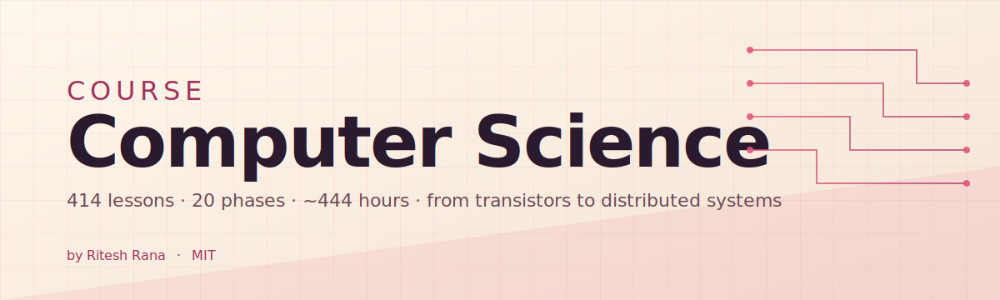
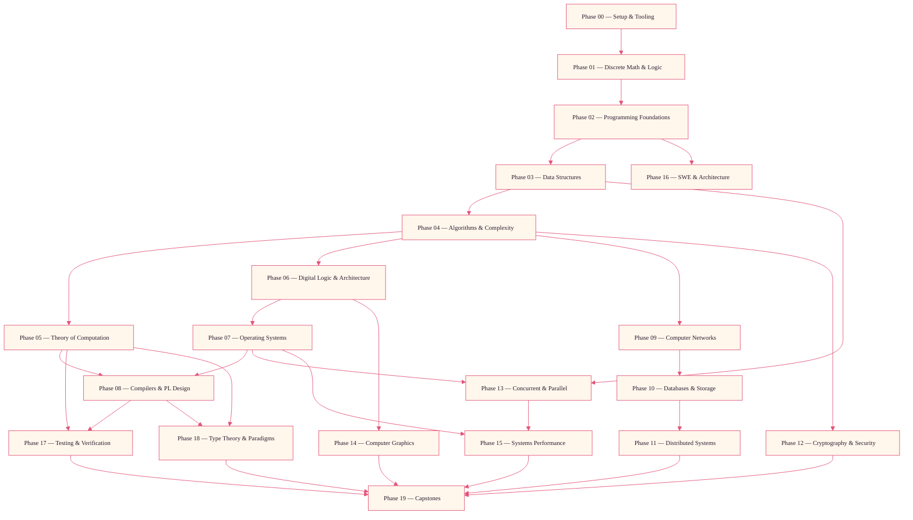
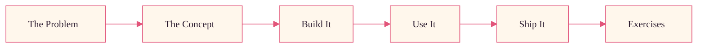

<p align="center">
  
</p>

<p align="center">
  <a href="LICENSE"></a>
  <a href="ROADMAP.md"></a>
  <a href="#contents"></a>
</p>

<p align="center"><sub>by <b>Ritesh Rana</b> &nbsp;·&nbsp; <a href="mailto:contact@riteshrana.engineer">contact@riteshrana.engineer</a></sub></p>

```
░░░▒▒▒░░░▒▒▒░░░▒▒▒░░░▒▒▒░░░▒▒▒░░░▒▒▒░░░▒▒▒░░░▒▒▒░░░▒▒▒░░░▒▒▒░░░▒▒▒░░░▒▒▒░░░▒▒▒░░░▒▒▒░░░▒▒▒
```

> **Most CS curricula teach concepts. Few make you build the artifacts.** This one does.
>
> 421 lessons. 20 phases. ~706 hours. C, C++, Rust, Go, Python, Haskell, SQL, RISC-V assembly,
> TLA+. Every lesson builds the thing from scratch first — bootloader, B-tree, TCP state
> machine, type-checker, Raft — then opens the production source for the same thing.
> Free, open source, MIT.
>
> You don't just learn CS. You build it. From transistors to a distributed database.
> By hand.

## How this works

Most CS material teaches concepts in isolation. A data-structures class here, an OS class
there, a databases class somewhere else. The pieces rarely line up. You hear "B-tree" in
data structures and then never see one until you accidentally `EXPLAIN ANALYZE` in
production five years later.

This curriculum is the spine. 20 phases, 421 lessons. Discrete math at one end, distributed
systems at the other. Every algorithm gets built from raw memory first. Allocator. Parser.
Scheduler. CPU pipeline. By the time you `socket()`, you already wrote the TCP state
machine yourself.

Each lesson runs the same loop: read the problem, understand the model, write the code,
compare against the production version, ship the artifact. No five-minute videos, no
copy-paste deploys, no hand-holding. Free, open source, and built to run on your own laptop.

```
░░░▒▒▒░░░▒▒▒░░░▒▒▒░░░▒▒▒░░░▒▒▒░░░▒▒▒░░░▒▒▒░░░▒▒▒░░░▒▒▒░░░▒▒▒░░░▒▒▒░░░▒▒▒░░░▒▒▒░░░▒▒▒░░░▒▒▒
```

## The shape of the curriculum

Twenty phases stack on top of each other. Foundations (math, programming, DS, algorithms,
theory) are the floor. Verticals (architecture, OS, compilers, networks, DB, distributed,
crypto, concurrency, graphics, perf) are the walls. Meta (software engineering, testing,
type theory, capstones) is the roof.



```
░░░▒▒▒░░░▒▒▒░░░▒▒▒░░░▒▒▒░░░▒▒▒░░░▒▒▒░░░▒▒▒░░░▒▒▒░░░▒▒▒░░░▒▒▒░░░▒▒▒░░░▒▒▒░░░▒▒▒░░░▒▒▒░░░▒▒▒
```

## The shape of a lesson

Each lesson lives in its own folder, with the same structure across the entire curriculum:

```
phases/<NN>-<phase-name>/<NN>-<lesson-name>/
├── code/      runnable implementations (C, Rust, C++, Python, Go, Haskell, asm, SQL, TLA+)
├── docs/
│   └── en.md  lesson narrative
├── quiz.json  pre/post MCQs with explanations
└── outputs/   the runnable artifact this lesson ships (tool, library, parser, etc.)
```

Every lesson follows six beats. The *Build It / Use It* split is the spine — you implement
the thing from scratch first, then read the production source. You understand what the
production code is doing because you wrote the smaller version yourself.



See [`LESSON_TEMPLATE.md`](LESSON_TEMPLATE.md) for the full lesson shape.

## Contributing

| Goal | Read |
|---|---|
| Contribute a lesson or fix | [CONTRIBUTING.md](CONTRIBUTING.md) |
| Fork for your team or school | [FORKING.md](FORKING.md) |
| Lesson template | [LESSON_TEMPLATE.md](LESSON_TEMPLATE.md) |
| Track progress | [ROADMAP.md](ROADMAP.md) |
| Glossary | [glossary/terms.md](glossary/terms.md) |
| Code of conduct | [CODE_OF_CONDUCT.md](CODE_OF_CONDUCT.md) |

```
░░░▒▒▒░░░▒▒▒░░░▒▒▒░░░▒▒▒░░░▒▒▒░░░▒▒▒░░░▒▒▒░░░▒▒▒░░░▒▒▒░░░▒▒▒░░░▒▒▒░░░▒▒▒░░░▒▒▒░░░▒▒▒░░░▒▒▒
```

## Contents

<!-- BEGIN AUTO-GENERATED PHASES -->

<details>
<summary><strong>Phase 0: Setup & Tooling</strong> <code>12 lessons</code> &nbsp; <em>Stand up a reproducible C/C++/Rust/Go/Haskell environment so every later phase just works.</em></summary>

| # | Lesson | Type | Lang |
|---|--------|------|------|
| 01 | [The CS Toolchain — What You'll Install and Why](phases/00-setup-and-tooling/01-the-cs-toolchain-what-you-ll-install-and-why/) | Learn | Shell |
| 02 | [Terminal, Shell, Pipes, Job Control](phases/00-setup-and-tooling/02-terminal-shell-pipes-job-control/) | Learn | Shell |
| 03 | [Git Deep — Internals, Refs, Rebase, Bisect](phases/00-setup-and-tooling/03-git-deep-internals-refs-rebase-bisect/) | Learn | Shell |
| 04 | [C/C++ Toolchain — gcc, clang, ld, ar, make](phases/00-setup-and-tooling/04-c-c-toolchain-gcc-clang-ld-ar-make/) | Learn | C, Makefile |
| 05 | [Rust Toolchain — cargo, rustup, build profiles](phases/00-setup-and-tooling/05-rust-toolchain-cargo-rustup-build-profiles/) | Learn | Rust |
| 06 | [Build Systems — Make, CMake, Bazel, Cargo](phases/00-setup-and-tooling/06-build-systems-make-cmake-bazel-cargo/) | Learn | Makefile, Shell |
| 07 | [Debuggers — gdb, lldb, rust-gdb, core dumps](phases/00-setup-and-tooling/07-debuggers-gdb-lldb-rust-gdb-core-dumps/) | Learn | C, Rust |
| 08 | [Profilers — perf, valgrind, instruments, flamegraphs](phases/00-setup-and-tooling/08-profilers-perf-valgrind-instruments-flamegraphs/) | Learn | Shell, C |
| 09 | [Editor Setup — Neovim/VS Code with LSP, DAP](phases/00-setup-and-tooling/09-editor-setup-neovim-vs-code-with-lsp-dap/) | Learn | Shell |
| 10 | [Linux for Builders — proc, sys, cgroups, namespaces](phases/00-setup-and-tooling/10-linux-for-builders-proc-sys-cgroups-namespaces/) | Learn | Shell, C |
| 11 | [Docker & Devcontainers for CS Work](phases/00-setup-and-tooling/11-docker-devcontainers-for-cs-work/) | Learn | Dockerfile, Shell |
| 12 | [Documentation & Diagrams — Markdown, Mermaid, plantuml](phases/00-setup-and-tooling/12-documentation-diagrams-markdown-mermaid-plantuml/) | Learn | Markdown |

_Phase capstone artifact: A reproducible polyglot toolchain. &nbsp;·&nbsp; ~13 h 15 min total._

</details>

<details>
<summary><strong>Phase 1: Discrete Math & Logic Foundations</strong> <code>24 lessons</code> &nbsp; <em>Build the proof, counting, and graph machinery every later phase quietly depends on.</em></summary>

| # | Lesson | Type | Lang |
|---|--------|------|------|
| 01 | [Propositional Logic & Truth Tables](phases/01-discrete-math-and-logic/01-propositional-logic-truth-tables/) | Learn | Python |
| 02 | [Predicate Logic & Quantifiers](phases/01-discrete-math-and-logic/02-predicate-logic-quantifiers/) | Learn | Python |
| 03 | [Proof Techniques — Direct, Contradiction, Induction](phases/01-discrete-math-and-logic/03-proof-techniques-direct-contradiction-induction/) | Learn | Python |
| 04 | [Sets, Relations, Functions](phases/01-discrete-math-and-logic/04-sets-relations-functions/) | Learn | Python |
| 05 | [Equivalence Relations & Partitions](phases/01-discrete-math-and-logic/05-equivalence-relations-partitions/) | Learn | Python |
| 06 | [Partial Orders, Lattices, Hasse Diagrams](phases/01-discrete-math-and-logic/06-partial-orders-lattices-hasse-diagrams/) | Learn | Python |
| 07 | [Cardinality, Countability, Diagonalization](phases/01-discrete-math-and-logic/07-cardinality-countability-diagonalization/) | Learn | Python |
| 08 | [Combinatorics — Counting, Permutations, Combinations](phases/01-discrete-math-and-logic/08-combinatorics-counting-permutations-combinations/) | Learn | Python, Rust |
| 09 | [Pigeonhole, Inclusion-Exclusion, Catalan](phases/01-discrete-math-and-logic/09-pigeonhole-inclusion-exclusion-catalan/) | Learn | Python |
| 10 | [Generating Functions](phases/01-discrete-math-and-logic/10-generating-functions/) | Learn | Python |
| 11 | [Recurrence Relations & the Master Theorem](phases/01-discrete-math-and-logic/11-recurrence-relations-the-master-theorem/) | Learn | Python |
| 12 | [Asymptotic Notation — Big-O, Θ, Ω, o, ω](phases/01-discrete-math-and-logic/12-asymptotic-notation-big-o-o/) | Learn | Python |
| 13 | [Number Theory — Divisibility, GCD, Bezout](phases/01-discrete-math-and-logic/13-number-theory-divisibility-gcd-bezout/) | Learn | Python, Rust |
| 14 | [Modular Arithmetic & Fermat / Euler](phases/01-discrete-math-and-logic/14-modular-arithmetic-fermat-euler/) | Learn | Python |
| 15 | [Primes, Sieves, Primality Tests](phases/01-discrete-math-and-logic/15-primes-sieves-primality-tests/) | Learn | Python, Rust |
| 16 | [Boolean Algebra & Karnaugh Maps](phases/01-discrete-math-and-logic/16-boolean-algebra-karnaugh-maps/) | Learn | Python |
| 17 | [Graph Theory I — Basics, Traversals, Trees](phases/01-discrete-math-and-logic/17-graph-theory-i-basics-traversals-trees/) | Learn | Python |
| 18 | [Graph Theory II — Coloring, Matching, Planarity](phases/01-discrete-math-and-logic/18-graph-theory-ii-coloring-matching-planarity/) | Learn | Python |
| 19 | [Discrete Probability & Expectation](phases/01-discrete-math-and-logic/19-discrete-probability-expectation/) | Learn | Python |
| 20 | [Markov Chains & Random Walks (Discrete)](phases/01-discrete-math-and-logic/20-markov-chains-random-walks-discrete/) | Learn | Python |
| 21 | [Information & Coding Theory (Discrete)](phases/01-discrete-math-and-logic/21-information-coding-theory-discrete/) | Learn | Python |
| 22 | [Phase Capstone — A Proof Companion CLI](phases/01-discrete-math-and-logic/22-phase-capstone-a-proof-companion-cli/) | Build | Python, Rust |
| 23 | [Linear Algebra Foundations](phases/01-discrete-math-and-logic/23-linear-algebra-foundations/) | Learn | Python |
| 24 | [Calculus and Continuous Math](phases/01-discrete-math-and-logic/24-calculus-and-continuous-math/) | Learn | Python |

_Phase capstone artifact: A proof companion CLI + combinatorics library. &nbsp;·&nbsp; ~23 h 45 min total._

</details>

<details>
<summary><strong>Phase 2: Programming Foundations & Memory Model</strong> <code>18 lessons</code> &nbsp; <em>Internalize the machine model: what a pointer really is, what the stack does, how Rust ownership works.</em></summary>

| # | Lesson | Type | Lang |
|---|--------|------|------|
| 01 | [What Is a Program, Really (Compilation, Linking, Loading)](phases/02-programming-foundations-and-memory-model/01-what-is-a-program-really-compilation-linking-loading/) | Learn | C, Shell |
| 02 | [Values, Types, Variables, Scope](phases/02-programming-foundations-and-memory-model/02-values-types-variables-scope/) | Learn | C, Rust |
| 03 | [Control Flow — Branches, Loops, Recursion](phases/02-programming-foundations-and-memory-model/03-control-flow-branches-loops-recursion/) | Learn | C, Rust |
| 04 | [Functions, the Stack, and Calling Conventions](phases/02-programming-foundations-and-memory-model/04-functions-the-stack-and-calling-conventions/) | Learn | C, RISC-V Assembly |
| 05 | [Pointers, Addresses, and Indirection (in C)](phases/02-programming-foundations-and-memory-model/05-pointers-addresses-and-indirection-in-c/) | Learn | C |
| 06 | [The Heap — malloc, free, fragmentation](phases/02-programming-foundations-and-memory-model/06-the-heap-malloc-free-fragmentation/) | Learn | C |
| 07 | [Arrays, Strings, and Bounds](phases/02-programming-foundations-and-memory-model/07-arrays-strings-and-bounds/) | Learn | C, Rust |
| 08 | [Structs, Unions, Bitfields, Alignment](phases/02-programming-foundations-and-memory-model/08-structs-unions-bitfields-alignment/) | Learn | C |
| 09 | [Errors — Returns, errno, exceptions, Result types](phases/02-programming-foundations-and-memory-model/09-errors-returns-errno-exceptions-result-types/) | Learn | C, Rust |
| 10 | [Ownership and Borrowing — the Rust model](phases/02-programming-foundations-and-memory-model/10-ownership-and-borrowing-the-rust-model/) | Learn | Rust |
| 11 | [Lifetimes, References, RAII](phases/02-programming-foundations-and-memory-model/11-lifetimes-references-raii/) | Learn | Rust, C++ |
| 12 | [Generics, Traits, Polymorphism](phases/02-programming-foundations-and-memory-model/12-generics-traits-polymorphism/) | Learn | Rust |
| 13 | [Modules, Packages, Linkage](phases/02-programming-foundations-and-memory-model/13-modules-packages-linkage/) | Learn | C, Rust |
| 14 | [The Preprocessor and Macros (C, Rust)](phases/02-programming-foundations-and-memory-model/14-the-preprocessor-and-macros-c-rust/) | Learn | C, Rust |
| 15 | [Build a Pool Allocator (from scratch in C)](phases/02-programming-foundations-and-memory-model/15-build-a-pool-allocator-from-scratch-in-c/) | Build | C |
| 16 | [Build a Bump and Arena Allocator (in Rust)](phases/02-programming-foundations-and-memory-model/16-build-a-bump-and-arena-allocator-in-rust/) | Build | Rust |
| 17 | [Defensive Programming — Asserts, Invariants, ASAN/UBSAN](phases/02-programming-foundations-and-memory-model/17-defensive-programming-asserts-invariants-asan-ubsan/) | Learn | C, Rust |
| 18 | [Phase Capstone — A Tiny Manual-Memory Library](phases/02-programming-foundations-and-memory-model/18-phase-capstone-a-tiny-manual-memory-library/) | Build | C, Rust |

_Phase capstone artifact: A tiny manual-memory library plus ownership demos. &nbsp;·&nbsp; ~20 h 0 min total._

</details>

<details>
<summary><strong>Phase 3: Data Structures</strong> <code>25 lessons</code> &nbsp; <em>Build every workhorse data structure from scratch and prove its invariants.</em></summary>

| # | Lesson | Type | Lang |
|---|--------|------|------|
| 01 | [Arrays & Dynamic Arrays (amortized analysis)](phases/03-data-structures/01-arrays-dynamic-arrays-amortized-analysis/) | Learn | Rust, Python |
| 02 | [Singly and Doubly Linked Lists](phases/03-data-structures/02-singly-and-doubly-linked-lists/) | Learn | C, Rust |
| 03 | [Stacks & Queues (array and list backings)](phases/03-data-structures/03-stacks-queues-array-and-list-backings/) | Learn | Rust, Python |
| 04 | [Deques, Ring Buffers, Circular Queues](phases/03-data-structures/04-deques-ring-buffers-circular-queues/) | Learn | Rust, C |
| 05 | [Hash Tables — Open Addressing vs Chaining](phases/03-data-structures/05-hash-tables-open-addressing-vs-chaining/) | Learn | Rust, Python |
| 06 | [Hash Function Design — Universal, Tabulation, SipHash](phases/03-data-structures/06-hash-function-design-universal-tabulation-siphash/) | Learn | Rust, Python |
| 07 | [Binary Trees — Traversal and Recursion Patterns](phases/03-data-structures/07-binary-trees-traversal-and-recursion-patterns/) | Learn | Rust, Python |
| 08 | [Binary Search Trees & Rotations](phases/03-data-structures/08-binary-search-trees-rotations/) | Learn | Rust, Python |
| 09 | [AVL Trees](phases/03-data-structures/09-avl-trees/) | Learn | Rust, Python |
| 10 | [Red-Black Trees](phases/03-data-structures/10-red-black-trees/) | Learn | Rust, Python |
| 11 | [Splay Trees & Treaps](phases/03-data-structures/11-splay-trees-treaps/) | Learn | Rust, Python |
| 12 | [B-Trees and B+-Trees](phases/03-data-structures/12-b-trees-and-b-trees/) | Learn | Rust, Python |
| 13 | [Heaps & Priority Queues (binary, Fibonacci, pairing)](phases/03-data-structures/13-heaps-priority-queues-binary-fibonacci-pairing/) | Learn | Rust, Python |
| 14 | [Tries and Radix Trees](phases/03-data-structures/14-tries-and-radix-trees/) | Learn | Rust, Python |
| 15 | [Suffix Trees and Suffix Arrays](phases/03-data-structures/15-suffix-trees-and-suffix-arrays/) | Learn | Rust, Python |
| 16 | [Disjoint Set Union (Union-Find)](phases/03-data-structures/16-disjoint-set-union-union-find/) | Learn | Rust, Python |
| 17 | [Segment Trees & Fenwick (BIT)](phases/03-data-structures/17-segment-trees-fenwick-bit/) | Learn | Rust, Python |
| 18 | [Sparse Tables & RMQ](phases/03-data-structures/18-sparse-tables-rmq/) | Learn | Rust, Python |
| 19 | [Skip Lists](phases/03-data-structures/19-skip-lists/) | Learn | Rust |
| 20 | [Bloom Filters, Cuckoo Filters, Count-Min Sketch](phases/03-data-structures/20-bloom-filters-cuckoo-filters-count-min-sketch/) | Learn | Rust, Python |
| 21 | [LSM Trees and Write-Optimized Structures](phases/03-data-structures/21-lsm-trees-and-write-optimized-structures/) | Learn | Rust |
| 22 | [Persistent / Immutable Data Structures](phases/03-data-structures/22-persistent-immutable-data-structures/) | Learn | Rust, Haskell |
| 23 | [Graphs — Representations and APIs](phases/03-data-structures/23-graphs-representations-and-apis/) | Learn | Rust, Python |
| 24 | [Concurrent Data Structures Preview (Treiber stack, MS queue)](phases/03-data-structures/24-concurrent-data-structures-preview-treiber-stack-ms-queue/) | Learn | Rust |
| 25 | [Phase Capstone — A Generic DS Library in Rust with Invariants](phases/03-data-structures/25-phase-capstone-a-generic-ds-library-in-rust-with-invariants/) | Build | Rust |

_Phase capstone artifact: A generic data-structure library in Rust with invariant checks. &nbsp;·&nbsp; ~30 h 45 min total._

</details>

<details>
<summary><strong>Phase 4: Algorithms & Complexity Analysis</strong> <code>31 lessons</code> &nbsp; <em>Master the canon — sorting, DP, graphs, strings, geometry, randomization — and the analysis tools that bound them.</em></summary>

| # | Lesson | Type | Lang |
|---|--------|------|------|
| 01 | [Analyzing Algorithms — Recurrences, Master Theorem in Action](phases/04-algorithms-and-complexity/01-analyzing-algorithms-recurrences-master-theorem-in-action/) | Learn | Python |
| 02 | [Sorting I — Insertion, Selection, Bubble, and Why They Lose](phases/04-algorithms-and-complexity/02-sorting-i-insertion-selection-bubble-and-why-they-lose/) | Learn | Python, Rust |
| 03 | [Sorting II — Merge, Quick (and Quickselect)](phases/04-algorithms-and-complexity/03-sorting-ii-merge-quick-and-quickselect/) | Learn | Python, Rust |
| 04 | [Sorting III — Heap, Intro, Tim](phases/04-algorithms-and-complexity/04-sorting-iii-heap-intro-tim/) | Learn | Python, Rust |
| 05 | [Sorting IV — Linear-Time: Counting, Radix, Bucket](phases/04-algorithms-and-complexity/05-sorting-iv-linear-time-counting-radix-bucket/) | Learn | Python, Rust |
| 06 | [Searching — Binary, Exponential, Ternary, Interpolation](phases/04-algorithms-and-complexity/06-searching-binary-exponential-ternary-interpolation/) | Learn | Python, Rust |
| 07 | [Divide & Conquer Patterns](phases/04-algorithms-and-complexity/07-divide-conquer-patterns/) | Learn | Python |
| 08 | [Dynamic Programming I — 1D, Memoization, Tabulation](phases/04-algorithms-and-complexity/08-dynamic-programming-i-1d-memoization-tabulation/) | Learn | Python |
| 09 | [Dynamic Programming II — 2D and Beyond](phases/04-algorithms-and-complexity/09-dynamic-programming-ii-2d-and-beyond/) | Learn | Python |
| 10 | [DP III — Bitmask, Digit, Tree, DP on DAGs](phases/04-algorithms-and-complexity/10-dp-iii-bitmask-digit-tree-dp-on-dags/) | Learn | Python, C++ |
| 11 | [Greedy Algorithms & Matroids](phases/04-algorithms-and-complexity/11-greedy-algorithms-matroids/) | Learn | Python |
| 12 | [Backtracking, Branch & Bound](phases/04-algorithms-and-complexity/12-backtracking-branch-bound/) | Learn | Python, C++ |
| 13 | [Graph Algorithms I — BFS, DFS, Topo, SCC](phases/04-algorithms-and-complexity/13-graph-algorithms-i-bfs-dfs-topo-scc/) | Learn | Python, Rust |
| 14 | [Graph Algorithms II — Dijkstra, Bellman-Ford, A*](phases/04-algorithms-and-complexity/14-graph-algorithms-ii-dijkstra-bellman-ford-a/) | Learn | Python, Rust |
| 15 | [Graph Algorithms III — Floyd-Warshall, Johnson, APSP](phases/04-algorithms-and-complexity/15-graph-algorithms-iii-floyd-warshall-johnson-apsp/) | Learn | Python |
| 16 | [Minimum Spanning Trees — Prim, Kruskal, Borůvka](phases/04-algorithms-and-complexity/16-minimum-spanning-trees-prim-kruskal-bor-vka/) | Learn | Python, Rust |
| 17 | [Network Flow — Ford-Fulkerson, Edmonds-Karp, Dinic](phases/04-algorithms-and-complexity/17-network-flow-ford-fulkerson-edmonds-karp-dinic/) | Learn | Python, C++ |
| 18 | [Matching — Bipartite, Hopcroft-Karp, Hungarian](phases/04-algorithms-and-complexity/18-matching-bipartite-hopcroft-karp-hungarian/) | Learn | Python, C++ |
| 19 | [String Matching — KMP, Z, Boyer-Moore](phases/04-algorithms-and-complexity/19-string-matching-kmp-z-boyer-moore/) | Learn | Python, Rust |
| 20 | [Suffix Structures in Action — Aho-Corasick, LCP](phases/04-algorithms-and-complexity/20-suffix-structures-in-action-aho-corasick-lcp/) | Learn | Python, Rust |
| 21 | [Hashing in Algorithms — Rabin-Karp, Rolling Hashes](phases/04-algorithms-and-complexity/21-hashing-in-algorithms-rabin-karp-rolling-hashes/) | Learn | Python, Rust |
| 22 | [Computational Geometry I — Convex Hull, Sweep Line](phases/04-algorithms-and-complexity/22-computational-geometry-i-convex-hull-sweep-line/) | Learn | Python, C++ |
| 23 | [Computational Geometry II — kd-Tree, R-Tree, Range Query](phases/04-algorithms-and-complexity/23-computational-geometry-ii-kd-tree-r-tree-range-query/) | Learn | Python, Rust |
| 24 | [Randomized Algorithms — Las Vegas vs Monte Carlo](phases/04-algorithms-and-complexity/24-randomized-algorithms-las-vegas-vs-monte-carlo/) | Learn | Python |
| 25 | [Approximation Algorithms — Vertex Cover, TSP, Set Cover](phases/04-algorithms-and-complexity/25-approximation-algorithms-vertex-cover-tsp-set-cover/) | Learn | Python |
| 26 | [Online Algorithms & Competitive Analysis](phases/04-algorithms-and-complexity/26-online-algorithms-competitive-analysis/) | Learn | Python |
| 27 | [Streaming Algorithms — Frequency, Quantiles, HyperLogLog](phases/04-algorithms-and-complexity/27-streaming-algorithms-frequency-quantiles-hyperloglog/) | Learn | Python, Rust |
| 28 | [Parallel Algorithms — PRAM, Brent, Map-Reduce style](phases/04-algorithms-and-complexity/28-parallel-algorithms-pram-brent-map-reduce-style/) | Learn | Python, Rust |
| 29 | [Amortized Analysis Deep — Aggregate, Accounting, Potential](phases/04-algorithms-and-complexity/29-amortized-analysis-deep-aggregate-accounting-potential/) | Learn | Python |
| 30 | [Phase Capstone — Algorithm Cookbook + Benchmark Harness](phases/04-algorithms-and-complexity/30-phase-capstone-algorithm-cookbook-benchmark-harness/) | Build | Rust, Python |
| 31 | [Numerical Methods and Scientific Computing](phases/04-algorithms-and-complexity/31-numerical-methods-and-scientific-computing/) | Learn | Python |

_Phase capstone artifact: An algorithms cookbook plus a benchmark harness. &nbsp;·&nbsp; ~35 h 45 min total._

</details>

<details>
<summary><strong>Phase 5: Theory of Computation</strong> <code>18 lessons</code> &nbsp; <em>From regular languages to undecidability — know what computers can't do and why.</em></summary>

| # | Lesson | Type | Lang |
|---|--------|------|------|
| 01 | [What Counts as Computation?](phases/05-theory-of-computation/01-what-counts-as-computation/) | Learn | Python |
| 02 | [Finite Automata — DFAs](phases/05-theory-of-computation/02-finite-automata-dfas/) | Learn | Python |
| 03 | [NFAs and Subset Construction](phases/05-theory-of-computation/03-nfas-and-subset-construction/) | Learn | Python |
| 04 | [Regular Expressions ↔ Automata](phases/05-theory-of-computation/04-regular-expressions-automata/) | Learn | Python |
| 05 | [Build a Regex Engine (Thompson construction)](phases/05-theory-of-computation/05-build-a-regex-engine-thompson-construction/) | Build | Python, Rust |
| 06 | [Pumping Lemma for Regular Languages](phases/05-theory-of-computation/06-pumping-lemma-for-regular-languages/) | Learn | Python |
| 07 | [Context-Free Grammars](phases/05-theory-of-computation/07-context-free-grammars/) | Learn | Python |
| 08 | [Pushdown Automata & CFG Equivalence](phases/05-theory-of-computation/08-pushdown-automata-cfg-equivalence/) | Learn | Python |
| 09 | [Chomsky and Greibach Normal Forms](phases/05-theory-of-computation/09-chomsky-and-greibach-normal-forms/) | Learn | Python |
| 10 | [Parsing Theory — CYK and Earley](phases/05-theory-of-computation/10-parsing-theory-cyk-and-earley/) | Learn | Python |
| 11 | [Turing Machines & Variants](phases/05-theory-of-computation/11-turing-machines-variants/) | Learn | Python |
| 12 | [Build a Turing Machine Simulator](phases/05-theory-of-computation/12-build-a-turing-machine-simulator/) | Build | Python, Rust |
| 13 | [Decidability and the Halting Problem](phases/05-theory-of-computation/13-decidability-and-the-halting-problem/) | Learn | Python |
| 14 | [Rice's Theorem & Undecidable Properties](phases/05-theory-of-computation/14-rice-s-theorem-undecidable-properties/) | Learn | Python |
| 15 | [Time Complexity Classes — P, NP, EXP](phases/05-theory-of-computation/15-time-complexity-classes-p-np-exp/) | Learn | Python |
| 16 | [NP-Completeness — Cook-Levin and Reductions](phases/05-theory-of-computation/16-np-completeness-cook-levin-and-reductions/) | Learn | Python |
| 17 | [Space Complexity — L, NL, PSPACE, Savitch](phases/05-theory-of-computation/17-space-complexity-l-nl-pspace-savitch/) | Learn | Python |
| 18 | [Phase Capstone — A Toy Proof Assistant for Reductions](phases/05-theory-of-computation/18-phase-capstone-a-toy-proof-assistant-for-reductions/) | Build | Python |

_Phase capstone artifact: A regex engine plus a Turing-machine simulator. &nbsp;·&nbsp; ~20 h 30 min total._

</details>

<details>
<summary><strong>Phase 6: Digital Logic & Computer Architecture</strong> <code>22 lessons</code> &nbsp; <em>Walk down from instruction to transistor, then back up: ALU, pipeline, cache, MMU.</em></summary>

| # | Lesson | Type | Lang |
|---|--------|------|------|
| 01 | [Bits, Bytes, Two's Complement, IEEE 754](phases/06-digital-logic-and-architecture/01-bits-bytes-two-s-complement-ieee-754/) | Learn | C, Python |
| 02 | [Transistors → Logic Gates](phases/06-digital-logic-and-architecture/02-transistors-logic-gates/) | Learn | SystemVerilog (HDL) |
| 03 | [Combinational Logic — Adders, Mux, Decoders](phases/06-digital-logic-and-architecture/03-combinational-logic-adders-mux-decoders/) | Learn | SystemVerilog (HDL) |
| 04 | [Sequential Logic — Latches, Flip-Flops, FSMs](phases/06-digital-logic-and-architecture/04-sequential-logic-latches-flip-flops-fsms/) | Learn | SystemVerilog (HDL) |
| 05 | [Build an ALU in HDL](phases/06-digital-logic-and-architecture/05-build-an-alu-in-hdl/) | Build | SystemVerilog (HDL) |
| 06 | [Registers, Register Files, Memory Banks](phases/06-digital-logic-and-architecture/06-registers-register-files-memory-banks/) | Learn | SystemVerilog (HDL) |
| 07 | [The Datapath — Single-Cycle CPU](phases/06-digital-logic-and-architecture/07-the-datapath-single-cycle-cpu/) | Learn | SystemVerilog (HDL) |
| 08 | [Control Unit — Microcoded vs Hardwired](phases/06-digital-logic-and-architecture/08-control-unit-microcoded-vs-hardwired/) | Learn | SystemVerilog (HDL) |
| 09 | [ISA Design — RISC vs CISC, RISC-V Tour](phases/06-digital-logic-and-architecture/09-isa-design-risc-vs-cisc-risc-v-tour/) | Learn | Markdown, RISC-V Assembly |
| 10 | [RISC-V Assembly — Hands-On](phases/06-digital-logic-and-architecture/10-risc-v-assembly-hands-on/) | Learn | RISC-V Assembly |
| 11 | [Pipelining — 5-Stage, Hazards, Forwarding](phases/06-digital-logic-and-architecture/11-pipelining-5-stage-hazards-forwarding/) | Learn | SystemVerilog (HDL) |
| 12 | [Branch Prediction — Static, Dynamic, Tournament](phases/06-digital-logic-and-architecture/12-branch-prediction-static-dynamic-tournament/) | Learn | SystemVerilog (HDL), C |
| 13 | [Out-of-Order Execution & Tomasulo](phases/06-digital-logic-and-architecture/13-out-of-order-execution-tomasulo/) | Learn | Python |
| 14 | [Memory Hierarchy — Cache Mapping & Coherence](phases/06-digital-logic-and-architecture/14-memory-hierarchy-cache-mapping-coherence/) | Learn | C |
| 15 | [Cache Performance — Locality, Blocking, Prefetch](phases/06-digital-logic-and-architecture/15-cache-performance-locality-blocking-prefetch/) | Learn | C, C++ |
| 16 | [Virtual Memory — TLB, Page Tables, MMU](phases/06-digital-logic-and-architecture/16-virtual-memory-tlb-page-tables-mmu/) | Learn | C |
| 17 | [I/O — DMA, MMIO, Interrupts](phases/06-digital-logic-and-architecture/17-i-o-dma-mmio-interrupts/) | Learn | C |
| 18 | [SIMD & Vector ISAs — AVX, SVE, RVV](phases/06-digital-logic-and-architecture/18-simd-vector-isas-avx-sve-rvv/) | Learn | C, C++ |
| 19 | [GPU Architecture — SIMT, Warps, Memory Hierarchy](phases/06-digital-logic-and-architecture/19-gpu-architecture-simt-warps-memory-hierarchy/) | Learn | CUDA C++ |
| 20 | [Modern Microarchitecture Tour (Apple Silicon, AMD Zen)](phases/06-digital-logic-and-architecture/20-modern-microarchitecture-tour-apple-silicon-amd-zen/) | Learn | Markdown |
| 21 | [Power, Heat, Reliability — Why Cores Stopped Scaling](phases/06-digital-logic-and-architecture/21-power-heat-reliability-why-cores-stopped-scaling/) | Learn | Markdown |
| 22 | [Phase Capstone — A 5-Stage Pipelined RISC-V CPU in HDL](phases/06-digital-logic-and-architecture/22-phase-capstone-a-5-stage-pipelined-risc-v-cpu-in-hdl/) | Build | SystemVerilog (HDL), RISC-V Assembly |

_Phase capstone artifact: A 5-stage pipelined RISC-V CPU in HDL with assembler. &nbsp;·&nbsp; ~28 h 0 min total._

</details>

<details>
<summary><strong>Phase 7: Operating Systems</strong> <code>24 lessons</code> &nbsp; <em>Write the abstractions you've always used: process, page, file, syscall.</em></summary>

| # | Lesson | Type | Lang |
|---|--------|------|------|
| 01 | [What an OS Actually Does (and Doesn't)](phases/07-operating-systems/01-what-an-os-actually-does-and-doesn-t/) | Learn | Markdown |
| 02 | [The Boot Process — BIOS, UEFI, GRUB](phases/07-operating-systems/02-the-boot-process-bios-uefi-grub/) | Learn | Shell |
| 03 | [Hello World as a Bootloader (in asm + C)](phases/07-operating-systems/03-hello-world-as-a-bootloader-in-asm-c/) | Build | RISC-V Assembly, C |
| 04 | [Privilege Modes, Traps, and System Calls](phases/07-operating-systems/04-privilege-modes-traps-and-system-calls/) | Learn | C, RISC-V Assembly |
| 05 | [Processes — fork, exec, wait](phases/07-operating-systems/05-processes-fork-exec-wait/) | Learn | C |
| 06 | [Threads, TLS, Context Switching](phases/07-operating-systems/06-threads-tls-context-switching/) | Learn | C |
| 07 | [Scheduling — FCFS, RR, MLFQ, CFS, EDF](phases/07-operating-systems/07-scheduling-fcfs-rr-mlfq-cfs-edf/) | Learn | C, Rust |
| 08 | [Virtual Memory in the OS — Demand Paging](phases/07-operating-systems/08-virtual-memory-in-the-os-demand-paging/) | Learn | C |
| 09 | [Page Replacement — LRU, Clock, ARC](phases/07-operating-systems/09-page-replacement-lru-clock-arc/) | Learn | C, Rust |
| 10 | [The Kernel Heap — slab and slub allocators](phases/07-operating-systems/10-the-kernel-heap-slab-and-slub-allocators/) | Learn | C |
| 11 | [File Systems I — VFS, inodes, journaling](phases/07-operating-systems/11-file-systems-i-vfs-inodes-journaling/) | Learn | C |
| 12 | [File Systems II — ext4, btrfs, ZFS deep cuts](phases/07-operating-systems/12-file-systems-ii-ext4-btrfs-zfs-deep-cuts/) | Learn | Markdown |
| 13 | [I/O Architecture — Block, Char, syscalls, vfs](phases/07-operating-systems/13-i-o-architecture-block-char-syscalls-vfs/) | Learn | C |
| 14 | [Synchronization in the Kernel — Spinlocks, RCU](phases/07-operating-systems/14-synchronization-in-the-kernel-spinlocks-rcu/) | Learn | C |
| 15 | [Deadlock — Detection, Prevention, Avoidance](phases/07-operating-systems/15-deadlock-detection-prevention-avoidance/) | Learn | C, Python |
| 16 | [IPC — Pipes, FIFOs, Shared Memory, sockets](phases/07-operating-systems/16-ipc-pipes-fifos-shared-memory-sockets/) | Learn | C |
| 17 | [Signals — Delivery, Handling, Pitfalls](phases/07-operating-systems/17-signals-delivery-handling-pitfalls/) | Learn | C |
| 18 | [Devices and Drivers — Char, Block, Net](phases/07-operating-systems/18-devices-and-drivers-char-block-net/) | Learn | C |
| 19 | [Containers — namespaces, cgroups, seccomp](phases/07-operating-systems/19-containers-namespaces-cgroups-seccomp/) | Learn | C, Shell |
| 20 | [Virtualization — Type 1/2 Hypervisors, KVM](phases/07-operating-systems/20-virtualization-type-1-2-hypervisors-kvm/) | Learn | C |
| 21 | [Microkernels and Unikernels](phases/07-operating-systems/21-microkernels-and-unikernels/) | Learn | Markdown |
| 22 | [Real-Time and Embedded OS](phases/07-operating-systems/22-real-time-and-embedded-os/) | Learn | C |
| 23 | [Linux Internals Tour — The Source Tree](phases/07-operating-systems/23-linux-internals-tour-the-source-tree/) | Learn | Markdown, Shell |
| 24 | [Phase Capstone — 'nanos': A Bootable Mini-Kernel](phases/07-operating-systems/24-phase-capstone-nanos-a-bootable-mini-kernel/) | Build | C, RISC-V Assembly |

_Phase capstone artifact: “nanos”: a bootable mini-kernel. &nbsp;·&nbsp; ~30 h 15 min total._

</details>

<details>
<summary><strong>Phase 8: Compilers & Programming Language Design</strong> <code>22 lessons</code> &nbsp; <em>Lex, parse, type-check, optimize, codegen — and then bootstrap.</em></summary>

| # | Lesson | Type | Lang |
|---|--------|------|------|
| 01 | [The Compilation Pipeline — End to End](phases/08-compilers-and-language-design/01-the-compilation-pipeline-end-to-end/) | Learn | Markdown |
| 02 | [Lexing I — Regex → DFA → Lexer](phases/08-compilers-and-language-design/02-lexing-i-regex-dfa-lexer/) | Learn | Rust, Python |
| 03 | [Lexing II — Hand-Written Scanners](phases/08-compilers-and-language-design/03-lexing-ii-hand-written-scanners/) | Learn | Rust, C |
| 04 | [Parsing I — Recursive Descent](phases/08-compilers-and-language-design/04-parsing-i-recursive-descent/) | Learn | Rust |
| 05 | [Parsing II — LL(1), Predictive Tables](phases/08-compilers-and-language-design/05-parsing-ii-ll-1-predictive-tables/) | Learn | Python |
| 06 | [Parsing III — LR, SLR, LALR, GLR](phases/08-compilers-and-language-design/06-parsing-iii-lr-slr-lalr-glr/) | Learn | Python |
| 07 | [PEG Parsers and Packrat](phases/08-compilers-and-language-design/07-peg-parsers-and-packrat/) | Learn | Rust |
| 08 | [Parser Generators (yacc/bison/lalrpop/tree-sitter)](phases/08-compilers-and-language-design/08-parser-generators-yacc-bison-lalrpop-tree-sitter/) | Learn | Rust |
| 09 | [AST Design and Visitor Patterns](phases/08-compilers-and-language-design/09-ast-design-and-visitor-patterns/) | Learn | Rust |
| 10 | [Semantic Analysis — Symbol Tables, Scopes](phases/08-compilers-and-language-design/10-semantic-analysis-symbol-tables-scopes/) | Learn | Rust |
| 11 | [Type Checking — Mono, Sub, Inference (HM)](phases/08-compilers-and-language-design/11-type-checking-mono-sub-inference-hm/) | Learn | Haskell, Rust |
| 12 | [Intermediate Representation — Three-Address Code](phases/08-compilers-and-language-design/12-intermediate-representation-three-address-code/) | Learn | Rust |
| 13 | [SSA Form — Construction and Dominance](phases/08-compilers-and-language-design/13-ssa-form-construction-and-dominance/) | Learn | Rust |
| 14 | [Classic Optimizations — DCE, CSE, Inlining, LICM](phases/08-compilers-and-language-design/14-classic-optimizations-dce-cse-inlining-licm/) | Learn | Rust |
| 15 | [Loop Optimization & Vectorization](phases/08-compilers-and-language-design/15-loop-optimization-vectorization/) | Learn | Rust, C |
| 16 | [Register Allocation — Linear Scan vs Graph Coloring](phases/08-compilers-and-language-design/16-register-allocation-linear-scan-vs-graph-coloring/) | Learn | Rust |
| 17 | [Code Generation — Instruction Selection, Scheduling](phases/08-compilers-and-language-design/17-code-generation-instruction-selection-scheduling/) | Learn | Rust, RISC-V Assembly |
| 18 | [Linkers and Loaders](phases/08-compilers-and-language-design/18-linkers-and-loaders/) | Learn | C, Shell |
| 19 | [Garbage Collection — Mark-Sweep, Copying, Generational](phases/08-compilers-and-language-design/19-garbage-collection-mark-sweep-copying-generational/) | Learn | Rust |
| 20 | [JIT Compilation — V8, JVM, LuaJIT principles](phases/08-compilers-and-language-design/20-jit-compilation-v8-jvm-luajit-principles/) | Learn | Rust |
| 21 | [LLVM in Practice — IR, Passes, Backends](phases/08-compilers-and-language-design/21-llvm-in-practice-ir-passes-backends/) | Learn | C++, Shell |
| 22 | [Phase Capstone — A Self-Hosting Compiler](phases/08-compilers-and-language-design/22-phase-capstone-a-self-hosting-compiler/) | Build | Rust |

_Phase capstone artifact: A self-hosting compiler for a Pascal-ish language. &nbsp;·&nbsp; ~29 h 0 min total._

</details>

<details>
<summary><strong>Phase 9: Computer Networks</strong> <code>22 lessons</code> &nbsp; <em>Build the stack: Ethernet, IP, TCP, TLS, HTTP — by hand.</em></summary>

| # | Lesson | Type | Lang |
|---|--------|------|------|
| 01 | [The Stack — Why Layers (OSI vs TCP/IP)](phases/09-computer-networks/01-the-stack-why-layers-osi-vs-tcp-ip/) | Learn | Markdown |
| 02 | [Physical & Link Layers — Ethernet, MAC, ARP](phases/09-computer-networks/02-physical-link-layers-ethernet-mac-arp/) | Learn | C, Python |
| 03 | [Network Layer — IPv4, IPv6, Subnetting, CIDR](phases/09-computer-networks/03-network-layer-ipv4-ipv6-subnetting-cidr/) | Learn | Python, C |
| 04 | [Routing I — Static, Distance Vector](phases/09-computer-networks/04-routing-i-static-distance-vector/) | Learn | Python |
| 05 | [Routing II — Link State (OSPF), BGP](phases/09-computer-networks/05-routing-ii-link-state-ospf-bgp/) | Learn | Python |
| 06 | [NAT, ICMP, DHCP, IPAM](phases/09-computer-networks/06-nat-icmp-dhcp-ipam/) | Learn | Python |
| 07 | [Transport — UDP, TCP State Machine](phases/09-computer-networks/07-transport-udp-tcp-state-machine/) | Learn | C, Rust |
| 08 | [TCP Congestion Control — Reno, CUBIC, BBR](phases/09-computer-networks/08-tcp-congestion-control-reno-cubic-bbr/) | Learn | Python, C |
| 09 | [QUIC and HTTP/3](phases/09-computer-networks/09-quic-and-http-3/) | Learn | Rust |
| 10 | [Sockets API — Build a TCP Echo Server](phases/09-computer-networks/10-sockets-api-build-a-tcp-echo-server/) | Learn | C, Rust |
| 11 | [Build a userspace TCP/IP stack (toy)](phases/09-computer-networks/11-build-a-userspace-tcp-ip-stack-toy/) | Build | Rust, C |
| 12 | [DNS — Resolvers, Records, DNSSEC](phases/09-computer-networks/12-dns-resolvers-records-dnssec/) | Learn | Python, C |
| 13 | [HTTP/1.1, HTTP/2 — Wire Format and Multiplexing](phases/09-computer-networks/13-http-1-1-http-2-wire-format-and-multiplexing/) | Learn | Rust, Python |
| 14 | [TLS in the Network Course (Handshake Overview)](phases/09-computer-networks/14-tls-in-the-network-course-handshake-overview/) | Learn | Python |
| 15 | [WebSockets, SSE, gRPC](phases/09-computer-networks/15-websockets-sse-grpc/) | Learn | Rust, TypeScript |
| 16 | [Firewalls, NAT Traversal, STUN/TURN/ICE](phases/09-computer-networks/16-firewalls-nat-traversal-stun-turn-ice/) | Learn | Python |
| 17 | [CDNs and Anycast](phases/09-computer-networks/17-cdns-and-anycast/) | Learn | Markdown |
| 18 | [Load Balancers — L4 vs L7, Algorithms](phases/09-computer-networks/18-load-balancers-l4-vs-l7-algorithms/) | Learn | Rust, Python |
| 19 | [P2P Networks — Kademlia, BitTorrent](phases/09-computer-networks/19-p2p-networks-kademlia-bittorrent/) | Learn | Rust, Python |
| 20 | [Software-Defined Networking & eBPF](phases/09-computer-networks/20-software-defined-networking-ebpf/) | Learn | C, Python |
| 21 | [Network Programming in Rust (async + tokio)](phases/09-computer-networks/21-network-programming-in-rust-async-tokio/) | Learn | Rust |
| 22 | [Phase Capstone — An HTTP/2 Server on a Custom TCP Stack](phases/09-computer-networks/22-phase-capstone-an-http-2-server-on-a-custom-tcp-stack/) | Build | Rust |

_Phase capstone artifact: An HTTP/2 server on a custom userspace TCP/IP stack. &nbsp;·&nbsp; ~27 h 15 min total._

</details>

<details>
<summary><strong>Phase 10: Databases & Storage Systems</strong> <code>22 lessons</code> &nbsp; <em>From relational algebra to MVCC: write the storage engine, write the planner.</em></summary>

| # | Lesson | Type | Lang |
|---|--------|------|------|
| 01 | [What a Database Actually Is](phases/10-databases-and-storage/01-what-a-database-actually-is/) | Learn | Markdown |
| 02 | [The Relational Model & Relational Algebra](phases/10-databases-and-storage/02-the-relational-model-relational-algebra/) | Learn | Python, SQL |
| 03 | [SQL — DDL, DML, Joins, Subqueries](phases/10-databases-and-storage/03-sql-ddl-dml-joins-subqueries/) | Learn | SQL |
| 04 | [Normalization 1NF → BCNF (and 4NF)](phases/10-databases-and-storage/04-normalization-1nf-bcnf-and-4nf/) | Learn | SQL, Python |
| 05 | [Physical Storage — Pages, Slotted Pages](phases/10-databases-and-storage/05-physical-storage-pages-slotted-pages/) | Learn | Rust, C |
| 06 | [Buffer Pool Management & Replacement](phases/10-databases-and-storage/06-buffer-pool-management-replacement/) | Learn | Rust |
| 07 | [Indexing — B+ Trees in DBs](phases/10-databases-and-storage/07-indexing-b-trees-in-dbs/) | Learn | Rust |
| 08 | [Indexing — Hash, Bitmap, GiST](phases/10-databases-and-storage/08-indexing-hash-bitmap-gist/) | Learn | Rust, Python |
| 09 | [LSM-Tree Storage Engines (LevelDB/RocksDB style)](phases/10-databases-and-storage/09-lsm-tree-storage-engines-leveldb-rocksdb-style/) | Learn | Rust |
| 10 | [Query Execution — Iterator vs Vectorized](phases/10-databases-and-storage/10-query-execution-iterator-vs-vectorized/) | Learn | Rust, Python |
| 11 | [Join Algorithms — Nested Loop, Hash, Sort-Merge](phases/10-databases-and-storage/11-join-algorithms-nested-loop-hash-sort-merge/) | Learn | Rust, Python |
| 12 | [Query Optimization — Plans, Cost, Cardinality](phases/10-databases-and-storage/12-query-optimization-plans-cost-cardinality/) | Learn | Python, SQL |
| 13 | [Transactions — ACID, Anomalies](phases/10-databases-and-storage/13-transactions-acid-anomalies/) | Learn | SQL, Python |
| 14 | [Isolation Levels — Read Committed → Serializable](phases/10-databases-and-storage/14-isolation-levels-read-committed-serializable/) | Learn | SQL, Python |
| 15 | [Concurrency Control — 2PL, OCC, MVCC](phases/10-databases-and-storage/15-concurrency-control-2pl-occ-mvcc/) | Learn | Rust, Python |
| 16 | [Recovery — WAL, ARIES](phases/10-databases-and-storage/16-recovery-wal-aries/) | Learn | Rust |
| 17 | [NoSQL — KV, Document, Wide-Column, Graph](phases/10-databases-and-storage/17-nosql-kv-document-wide-column-graph/) | Learn | Python |
| 18 | [Distributed DBs — Sharding, Replication, Spanner](phases/10-databases-and-storage/18-distributed-dbs-sharding-replication-spanner/) | Learn | Markdown, Go |
| 19 | [Columnar Storage & OLAP — Parquet, DuckDB](phases/10-databases-and-storage/19-columnar-storage-olap-parquet-duckdb/) | Learn | Python, SQL |
| 20 | [Vector Databases — HNSW, IVF, PQ](phases/10-databases-and-storage/20-vector-databases-hnsw-ivf-pq/) | Learn | Rust, Python |
| 21 | [Time-Series and Event-Sourced Stores](phases/10-databases-and-storage/21-time-series-and-event-sourced-stores/) | Learn | Python, SQL |
| 22 | [Phase Capstone — Build an MVCC KV Store with a SQL Frontend](phases/10-databases-and-storage/22-phase-capstone-build-an-mvcc-kv-store-with-a-sql-frontend/) | Build | Rust, SQL |

_Phase capstone artifact: An MVCC KV store with a SQL frontend. &nbsp;·&nbsp; ~29 h 0 min total._

</details>

<details>
<summary><strong>Phase 11: Distributed Systems</strong> <code>22 lessons</code> &nbsp; <em>Clocks, consensus, replication, CRDTs — and a Raft you can break and watch heal.</em></summary>

| # | Lesson | Type | Lang |
|---|--------|------|------|
| 01 | [What Distribution Costs You](phases/11-distributed-systems/01-what-distribution-costs-you/) | Learn | Markdown |
| 02 | [Failure Models — Crash, Omission, Byzantine](phases/11-distributed-systems/02-failure-models-crash-omission-byzantine/) | Learn | Markdown |
| 03 | [Time — Physical, Logical, Lamport Clocks](phases/11-distributed-systems/03-time-physical-logical-lamport-clocks/) | Learn | Go, Python |
| 04 | [Vector Clocks and Causal Order](phases/11-distributed-systems/04-vector-clocks-and-causal-order/) | Learn | Go, Python |
| 05 | [The FLP Impossibility Result](phases/11-distributed-systems/05-the-flp-impossibility-result/) | Learn | Markdown, Python |
| 06 | [CAP and PACELC — Read Honestly](phases/11-distributed-systems/06-cap-and-pacelc-read-honestly/) | Learn | Markdown |
| 07 | [Consensus I — Paxos (Single-Decree)](phases/11-distributed-systems/07-consensus-i-paxos-single-decree/) | Learn | Go, TLA+ |
| 08 | [Consensus II — Multi-Paxos and Variants](phases/11-distributed-systems/08-consensus-ii-multi-paxos-and-variants/) | Learn | Go |
| 09 | [Consensus III — Raft (with a working implementation)](phases/11-distributed-systems/09-consensus-iii-raft-with-a-working-implementation/) | Build | Go, Rust |
| 10 | [Replication — Leader/Follower, Quorum](phases/11-distributed-systems/10-replication-leader-follower-quorum/) | Learn | Go |
| 11 | [Eventual Consistency & Read-Repair](phases/11-distributed-systems/11-eventual-consistency-read-repair/) | Learn | Go, Python |
| 12 | [CRDTs — Counters, Sets, Sequences](phases/11-distributed-systems/12-crdts-counters-sets-sequences/) | Learn | Rust, TypeScript |
| 13 | [Gossip Protocols & SWIM](phases/11-distributed-systems/13-gossip-protocols-swim/) | Learn | Go |
| 14 | [Distributed Transactions — 2PC, 3PC, Sagas](phases/11-distributed-systems/14-distributed-transactions-2pc-3pc-sagas/) | Learn | Go, Python |
| 15 | [Distributed File Systems — GFS, HDFS](phases/11-distributed-systems/15-distributed-file-systems-gfs-hdfs/) | Learn | Markdown, Python |
| 16 | [MapReduce, Spark, Dataflow](phases/11-distributed-systems/16-mapreduce-spark-dataflow/) | Learn | Python, Scala |
| 17 | [Service Discovery, Membership, Leader Election](phases/11-distributed-systems/17-service-discovery-membership-leader-election/) | Learn | Go |
| 18 | [Distributed Caches — Memcached, Redis, consistent hashing](phases/11-distributed-systems/18-distributed-caches-memcached-redis-consistent-hashing/) | Learn | Go, Python |
| 19 | [Message Queues & Streams — Kafka, NATS](phases/11-distributed-systems/19-message-queues-streams-kafka-nats/) | Learn | Go, Python |
| 20 | [Microservices vs Monolith — Real Trade-offs](phases/11-distributed-systems/20-microservices-vs-monolith-real-trade-offs/) | Learn | Markdown |
| 21 | [Observability — Metrics, Traces, Logs in Distributed Systems](phases/11-distributed-systems/21-observability-metrics-traces-logs-in-distributed-systems/) | Learn | Go, TypeScript |
| 22 | [Phase Capstone — A Raft-Replicated KV Store with Snapshotting](phases/11-distributed-systems/22-phase-capstone-a-raft-replicated-kv-store-with-snapshotting/) | Build | Go, Rust |

_Phase capstone artifact: A Raft-replicated KV store with snapshotting. &nbsp;·&nbsp; ~28 h 0 min total._

</details>

<details>
<summary><strong>Phase 12: Cryptography & Security</strong> <code>24 lessons</code> &nbsp; <em>Build the primitives, then the protocols, then the attacks that bypass both.</em></summary>

| # | Lesson | Type | Lang |
|---|--------|------|------|
| 01 | [What Cryptography Actually Promises](phases/12-cryptography-and-security/01-what-cryptography-actually-promises/) | Learn | Markdown |
| 02 | [Classical Ciphers and Why They Fail](phases/12-cryptography-and-security/02-classical-ciphers-and-why-they-fail/) | Learn | Python |
| 03 | [Symmetric I — Stream Ciphers and One-Time Pad](phases/12-cryptography-and-security/03-symmetric-i-stream-ciphers-and-one-time-pad/) | Learn | Python, Rust |
| 04 | [Symmetric II — Block Ciphers, AES Internals](phases/12-cryptography-and-security/04-symmetric-ii-block-ciphers-aes-internals/) | Learn | C, Rust |
| 05 | [Modes of Operation — ECB, CBC, CTR, GCM](phases/12-cryptography-and-security/05-modes-of-operation-ecb-cbc-ctr-gcm/) | Learn | Python, Rust |
| 06 | [Hash Functions — SHA-2, SHA-3, BLAKE](phases/12-cryptography-and-security/06-hash-functions-sha-2-sha-3-blake/) | Learn | C, Rust |
| 07 | [MACs and HMAC](phases/12-cryptography-and-security/07-macs-and-hmac/) | Learn | Python, Rust |
| 08 | [Authenticated Encryption (AEAD)](phases/12-cryptography-and-security/08-authenticated-encryption-aead/) | Learn | Rust |
| 09 | [Public Key I — Diffie-Hellman](phases/12-cryptography-and-security/09-public-key-i-diffie-hellman/) | Learn | Python, Rust |
| 10 | [Public Key II — RSA Internals & Padding](phases/12-cryptography-and-security/10-public-key-ii-rsa-internals-padding/) | Learn | Python, Rust |
| 11 | [Public Key III — Elliptic Curves & Ed25519](phases/12-cryptography-and-security/11-public-key-iii-elliptic-curves-ed25519/) | Learn | Rust, Python |
| 12 | [Digital Signatures — ECDSA, EdDSA, BLS](phases/12-cryptography-and-security/12-digital-signatures-ecdsa-eddsa-bls/) | Learn | Rust |
| 13 | [KDFs, PBKDF2, scrypt, Argon2](phases/12-cryptography-and-security/13-kdfs-pbkdf2-scrypt-argon2/) | Learn | Rust, Python |
| 14 | [TLS 1.3 — Handshake, Records, 0-RTT](phases/12-cryptography-and-security/14-tls-1-3-handshake-records-0-rtt/) | Learn | Rust |
| 15 | [Build a Toy TLS 1.3 Client](phases/12-cryptography-and-security/15-build-a-toy-tls-1-3-client/) | Build | Rust |
| 16 | [PKI, Certs, Transparency](phases/12-cryptography-and-security/16-pki-certs-transparency/) | Learn | Markdown, Python |
| 17 | [Zero-Knowledge Proofs — Sigma, zk-SNARK overview](phases/12-cryptography-and-security/17-zero-knowledge-proofs-sigma-zk-snark-overview/) | Learn | Python, Rust |
| 18 | [Post-Quantum — Kyber, Dilithium, SPHINCS+](phases/12-cryptography-and-security/18-post-quantum-kyber-dilithium-sphincs/) | Learn | Rust |
| 19 | [Side-Channels — Timing, Cache, Spectre/Meltdown](phases/12-cryptography-and-security/19-side-channels-timing-cache-spectre-meltdown/) | Learn | C |
| 20 | [Memory-Safety Attacks — Stack Smash, ROP, ASLR](phases/12-cryptography-and-security/20-memory-safety-attacks-stack-smash-rop-aslr/) | Learn | C, RISC-V Assembly |
| 21 | [Web Security — XSS, CSRF, SQLi, SSRF, deserialization](phases/12-cryptography-and-security/21-web-security-xss-csrf-sqli-ssrf-deserialization/) | Learn | TypeScript, Python |
| 22 | [Threat Modeling — STRIDE, DREAD, attack trees](phases/12-cryptography-and-security/22-threat-modeling-stride-dread-attack-trees/) | Learn | Markdown |
| 23 | [CTF Toolkit — pwntools, GDB, Ghidra](phases/12-cryptography-and-security/23-ctf-toolkit-pwntools-gdb-ghidra/) | Learn | Python, Shell |
| 24 | [Phase Capstone — A TLS 1.3 Library + a Mini-CTF](phases/12-cryptography-and-security/24-phase-capstone-a-tls-1-3-library-a-mini-ctf/) | Build | Rust, Python |

_Phase capstone artifact: A TLS 1.3 implementation plus a mini-CTF toolkit. &nbsp;·&nbsp; ~30 h 45 min total._

</details>

<details>
<summary><strong>Phase 13: Concurrent & Parallel Computing</strong> <code>22 lessons</code> &nbsp; <em>Get atomic, lock-free, async, and GPU all right — with a memory model in your head.</em></summary>

| # | Lesson | Type | Lang |
|---|--------|------|------|
| 01 | [Concurrency vs Parallelism — Get This Right](phases/13-concurrent-and-parallel/01-concurrency-vs-parallelism-get-this-right/) | Learn | Markdown |
| 02 | [Race Conditions, Atomicity, Visibility](phases/13-concurrent-and-parallel/02-race-conditions-atomicity-visibility/) | Learn | C, Rust |
| 03 | [Memory Models — Sequential Consistency vs Relaxed](phases/13-concurrent-and-parallel/03-memory-models-sequential-consistency-vs-relaxed/) | Learn | C++, Rust |
| 04 | [Locks — Mutex, RW Lock, Spinlock, Ticket Lock](phases/13-concurrent-and-parallel/04-locks-mutex-rw-lock-spinlock-ticket-lock/) | Learn | C, Rust |
| 05 | [Condition Variables and Monitors](phases/13-concurrent-and-parallel/05-condition-variables-and-monitors/) | Learn | C, Rust |
| 06 | [Semaphores and the Classics (Producer/Consumer, Dining)](phases/13-concurrent-and-parallel/06-semaphores-and-the-classics-producer-consumer-dining/) | Learn | C, Go |
| 07 | [Atomics, CAS, ABA Problem](phases/13-concurrent-and-parallel/07-atomics-cas-aba-problem/) | Learn | Rust, C++ |
| 08 | [Lock-Free Data Structures — Treiber Stack, MS Queue](phases/13-concurrent-and-parallel/08-lock-free-data-structures-treiber-stack-ms-queue/) | Learn | Rust, C++ |
| 09 | [Wait-Free Algorithms and Their Limits](phases/13-concurrent-and-parallel/09-wait-free-algorithms-and-their-limits/) | Learn | Rust |
| 10 | [Software Transactional Memory](phases/13-concurrent-and-parallel/10-software-transactional-memory/) | Learn | Haskell, Rust |
| 11 | [Futures, Promises, async/await](phases/13-concurrent-and-parallel/11-futures-promises-async-await/) | Learn | Rust, TypeScript |
| 12 | [Reactor and Proactor Patterns — epoll, kqueue, io_uring](phases/13-concurrent-and-parallel/12-reactor-and-proactor-patterns-epoll-kqueue-io-uring/) | Learn | C, Rust |
| 13 | [Tokio and the Async Runtime in Rust](phases/13-concurrent-and-parallel/13-tokio-and-the-async-runtime-in-rust/) | Learn | Rust |
| 14 | [CSP and Go Channels](phases/13-concurrent-and-parallel/14-csp-and-go-channels/) | Learn | Go |
| 15 | [The Actor Model — Erlang and Akka principles](phases/13-concurrent-and-parallel/15-the-actor-model-erlang-and-akka-principles/) | Learn | Erlang, Rust |
| 16 | [Parallel Patterns — Map, Reduce, Pipeline, Scan](phases/13-concurrent-and-parallel/16-parallel-patterns-map-reduce-pipeline-scan/) | Learn | Rust, Python |
| 17 | [Work-Stealing Schedulers](phases/13-concurrent-and-parallel/17-work-stealing-schedulers/) | Learn | Rust |
| 18 | [SIMD Programming in Practice](phases/13-concurrent-and-parallel/18-simd-programming-in-practice/) | Learn | C++, Rust |
| 19 | [GPU Programming — CUDA Basics](phases/13-concurrent-and-parallel/19-gpu-programming-cuda-basics/) | Learn | CUDA C++ |
| 20 | [GPU Programming — WebGPU / Compute Shaders](phases/13-concurrent-and-parallel/20-gpu-programming-webgpu-compute-shaders/) | Learn | WGSL, TypeScript |
| 21 | [MPI and Distributed-Memory Parallelism](phases/13-concurrent-and-parallel/21-mpi-and-distributed-memory-parallelism/) | Learn | C, Python |
| 22 | [Phase Capstone — A Work-Stealing Scheduler + Lock-Free Queue](phases/13-concurrent-and-parallel/22-phase-capstone-a-work-stealing-scheduler-lock-free-queue/) | Build | Rust |

_Phase capstone artifact: A work-stealing scheduler plus a lock-free queue. &nbsp;·&nbsp; ~28 h 0 min total._

</details>

<details>
<summary><strong>Phase 14: Computer Graphics & Visualization</strong> <code>18 lessons</code> &nbsp; <em>Rasterize. Ray-trace. Path-trace. Make pixels meaningful.</em></summary>

| # | Lesson | Type | Lang |
|---|--------|------|------|
| 01 | [Pixels, Colors, Gamma](phases/14-graphics-and-visualization/01-pixels-colors-gamma/) | Learn | Python |
| 02 | [The Graphics Pipeline at 30,000 ft](phases/14-graphics-and-visualization/02-the-graphics-pipeline-at-30-000-ft/) | Learn | Markdown |
| 03 | [Linear Algebra for Graphics — Transforms, Projections](phases/14-graphics-and-visualization/03-linear-algebra-for-graphics-transforms-projections/) | Learn | Python, Rust |
| 04 | [Rasterization I — Lines and Triangles](phases/14-graphics-and-visualization/04-rasterization-i-lines-and-triangles/) | Learn | Rust, C++ |
| 05 | [Rasterization II — Z-buffer, Clipping, Culling](phases/14-graphics-and-visualization/05-rasterization-ii-z-buffer-clipping-culling/) | Learn | Rust, C++ |
| 06 | [Shading Models — Lambert, Phong, Blinn-Phong](phases/14-graphics-and-visualization/06-shading-models-lambert-phong-blinn-phong/) | Learn | GLSL, Rust |
| 07 | [Physically Based Rendering — BRDF, Microfacet](phases/14-graphics-and-visualization/07-physically-based-rendering-brdf-microfacet/) | Learn | GLSL, Rust |
| 08 | [Shaders 101 — Vertex and Fragment](phases/14-graphics-and-visualization/08-shaders-101-vertex-and-fragment/) | Learn | GLSL, WGSL |
| 09 | [Build a Software Rasterizer (in Rust)](phases/14-graphics-and-visualization/09-build-a-software-rasterizer-in-rust/) | Build | Rust |
| 10 | [Ray Tracing I — Whitted Style](phases/14-graphics-and-visualization/10-ray-tracing-i-whitted-style/) | Learn | Rust, C++ |
| 11 | [Ray Tracing II — Path Tracing, Monte Carlo](phases/14-graphics-and-visualization/11-ray-tracing-ii-path-tracing-monte-carlo/) | Learn | Rust |
| 12 | [Acceleration Structures — BVH, kd-Tree](phases/14-graphics-and-visualization/12-acceleration-structures-bvh-kd-tree/) | Learn | Rust |
| 13 | [Real-Time Techniques — Deferred, Tiled, Cluster](phases/14-graphics-and-visualization/13-real-time-techniques-deferred-tiled-cluster/) | Learn | GLSL, Rust |
| 14 | [Modern APIs — Vulkan, Metal, WebGPU compared](phases/14-graphics-and-visualization/14-modern-apis-vulkan-metal-webgpu-compared/) | Learn | Markdown |
| 15 | [Compute Shaders for Non-Graphics Work](phases/14-graphics-and-visualization/15-compute-shaders-for-non-graphics-work/) | Learn | WGSL, CUDA C++ |
| 16 | [Animation, Skinning, IK](phases/14-graphics-and-visualization/16-animation-skinning-ik/) | Learn | Rust |
| 17 | [Visualization — D3, deck.gl, scientific plotting](phases/14-graphics-and-visualization/17-visualization-d3-deck-gl-scientific-plotting/) | Learn | TypeScript, Python |
| 18 | [Phase Capstone — A Path Tracer + a Triangle Rasterizer](phases/14-graphics-and-visualization/18-phase-capstone-a-path-tracer-a-triangle-rasterizer/) | Build | Rust |

_Phase capstone artifact: A path tracer plus a triangle rasterizer. &nbsp;·&nbsp; ~23 h 15 min total._

</details>

<details>
<summary><strong>Phase 15: Systems Programming & Performance</strong> <code>20 lessons</code> &nbsp; <em>Measure honestly. Tune cache, branches, IO. Win 10x by knowing the machine.</em></summary>

| # | Lesson | Type | Lang |
|---|--------|------|------|
| 01 | [How to Think About Performance](phases/15-systems-performance/01-how-to-think-about-performance/) | Learn | Markdown |
| 02 | [Measurement Discipline — Benchmarks That Don't Lie](phases/15-systems-performance/02-measurement-discipline-benchmarks-that-don-t-lie/) | Learn | Rust, C++ |
| 03 | [Profiling — perf, dtrace, Instruments, eBPF](phases/15-systems-performance/03-profiling-perf-dtrace-instruments-ebpf/) | Learn | Shell, C |
| 04 | [Flamegraphs, Hotspots, and Reading Stacks](phases/15-systems-performance/04-flamegraphs-hotspots-and-reading-stacks/) | Learn | Shell |
| 05 | [Cache-Aware Algorithm Design](phases/15-systems-performance/05-cache-aware-algorithm-design/) | Learn | C++, Rust |
| 06 | [False Sharing and NUMA](phases/15-systems-performance/06-false-sharing-and-numa/) | Learn | C++, Rust |
| 07 | [Branch Prediction and Layout Tricks](phases/15-systems-performance/07-branch-prediction-and-layout-tricks/) | Learn | C++ |
| 08 | [Vectorization in Practice (auto and intrinsics)](phases/15-systems-performance/08-vectorization-in-practice-auto-and-intrinsics/) | Learn | C++, Rust |
| 09 | [Memory Allocators in Production — jemalloc, mimalloc](phases/15-systems-performance/09-memory-allocators-in-production-jemalloc-mimalloc/) | Learn | C |
| 10 | [Zero-Copy and mmap](phases/15-systems-performance/10-zero-copy-and-mmap/) | Learn | C |
| 11 | [Asynchronous I/O — io_uring Deep Dive](phases/15-systems-performance/11-asynchronous-i-o-io-uring-deep-dive/) | Learn | C, Rust |
| 12 | [Kernel Bypass — DPDK, SPDK, AF_XDP](phases/15-systems-performance/12-kernel-bypass-dpdk-spdk-af-xdp/) | Learn | C |
| 13 | [Lock Contention Patterns and Cures](phases/15-systems-performance/13-lock-contention-patterns-and-cures/) | Learn | Rust, C++ |
| 14 | [Coroutines and Stackful vs Stackless Concurrency](phases/15-systems-performance/14-coroutines-and-stackful-vs-stackless-concurrency/) | Learn | C++, Rust |
| 15 | [C++ Low-Latency Idioms](phases/15-systems-performance/15-c-low-latency-idioms/) | Learn | C++ |
| 16 | [Rust for High Performance — UnsafeCell, MaybeUninit, alignment](phases/15-systems-performance/16-rust-for-high-performance-unsafecell-maybeuninit-alignment/) | Learn | Rust |
| 17 | [Power, Frequency Scaling, Thermal Throttling](phases/15-systems-performance/17-power-frequency-scaling-thermal-throttling/) | Learn | Markdown |
| 18 | [Reliability Engineering — Tail Latency, Hedging](phases/15-systems-performance/18-reliability-engineering-tail-latency-hedging/) | Learn | Go, Rust |
| 19 | [Capacity Planning and Little's Law](phases/15-systems-performance/19-capacity-planning-and-little-s-law/) | Learn | Python |
| 20 | [Phase Capstone — A Profile-Guided Optimization Walk-Through](phases/15-systems-performance/20-phase-capstone-a-profile-guided-optimization-walk-through/) | Build | Rust, C++ |

_Phase capstone artifact: A profile-guided optimization walk-through. &nbsp;·&nbsp; ~24 h 15 min total._

</details>

<details>
<summary><strong>Phase 16: Software Engineering & Architecture</strong> <code>24 lessons</code> &nbsp; <em>Make code other people can read, change, and ship — at scale, over years.</em></summary>

| # | Lesson | Type | Lang |
|---|--------|------|------|
| 01 | [What Makes Software 'Engineered'](phases/16-software-engineering-and-architecture/01-what-makes-software-engineered/) | Learn | Markdown |
| 02 | [Naming, Cohesion, Coupling](phases/16-software-engineering-and-architecture/02-naming-cohesion-coupling/) | Learn | TypeScript, Python |
| 03 | [SOLID Principles — Demystified](phases/16-software-engineering-and-architecture/03-solid-principles-demystified/) | Learn | TypeScript, Python |
| 04 | [GoF Patterns That Still Matter](phases/16-software-engineering-and-architecture/04-gof-patterns-that-still-matter/) | Learn | TypeScript, Python |
| 05 | [Modern Patterns — Functional Core / Imperative Shell](phases/16-software-engineering-and-architecture/05-modern-patterns-functional-core-imperative-shell/) | Learn | TypeScript, Rust |
| 06 | [Refactoring Catalogue and Mechanics](phases/16-software-engineering-and-architecture/06-refactoring-catalogue-and-mechanics/) | Learn | TypeScript, Python |
| 07 | [Code Review Practice](phases/16-software-engineering-and-architecture/07-code-review-practice/) | Learn | Markdown |
| 08 | [Domain-Driven Design — Bounded Contexts, Aggregates](phases/16-software-engineering-and-architecture/08-domain-driven-design-bounded-contexts-aggregates/) | Learn | TypeScript, Python |
| 09 | [Hexagonal / Clean Architecture](phases/16-software-engineering-and-architecture/09-hexagonal-clean-architecture/) | Learn | TypeScript |
| 10 | [Event-Driven Architectures](phases/16-software-engineering-and-architecture/10-event-driven-architectures/) | Learn | TypeScript, Go |
| 11 | [CQRS and Event Sourcing](phases/16-software-engineering-and-architecture/11-cqrs-and-event-sourcing/) | Learn | TypeScript, Rust |
| 12 | [Microservices — When and When Not](phases/16-software-engineering-and-architecture/12-microservices-when-and-when-not/) | Learn | Markdown |
| 13 | [API Design — REST, GraphQL, gRPC Trade-offs](phases/16-software-engineering-and-architecture/13-api-design-rest-graphql-grpc-trade-offs/) | Learn | TypeScript, Protobuf |
| 14 | [Versioning, Deprecation, Compatibility](phases/16-software-engineering-and-architecture/14-versioning-deprecation-compatibility/) | Learn | Markdown |
| 15 | [Monorepos vs Polyrepos](phases/16-software-engineering-and-architecture/15-monorepos-vs-polyrepos/) | Learn | Markdown |
| 16 | [Dependency Management & SemVer](phases/16-software-engineering-and-architecture/16-dependency-management-semver/) | Learn | Markdown, Shell |
| 17 | [Build & CI/CD — Pipelines That Don't Suck](phases/16-software-engineering-and-architecture/17-build-ci-cd-pipelines-that-don-t-suck/) | Learn | YAML, Shell |
| 18 | [Observability as a Design Concern](phases/16-software-engineering-and-architecture/18-observability-as-a-design-concern/) | Learn | TypeScript, Go |
| 19 | [Technical Debt — Measure, Pay Down, Negotiate](phases/16-software-engineering-and-architecture/19-technical-debt-measure-pay-down-negotiate/) | Learn | Markdown |
| 20 | [Architecture Decision Records (ADRs)](phases/16-software-engineering-and-architecture/20-architecture-decision-records-adrs/) | Learn | Markdown |
| 21 | [Reading Large Codebases](phases/16-software-engineering-and-architecture/21-reading-large-codebases/) | Learn | Markdown, Shell |
| 22 | [Phase Capstone — Refactor a Real OSS Repo + ADR Bundle](phases/16-software-engineering-and-architecture/22-phase-capstone-refactor-a-real-oss-repo-adr-bundle/) | Build | TypeScript, Markdown |
| 23 | [Human-Computer Interaction Design Principles](phases/16-software-engineering-and-architecture/23-human-computer-interaction-design-principles/) | Learn | TypeScript, Python |
| 24 | [Software Project Management and Estimation](phases/16-software-engineering-and-architecture/24-software-project-management-and-estimation/) | Learn | Markdown |

_Phase capstone artifact: A refactored real-world OSS repo with ADRs. &nbsp;·&nbsp; ~23 h 30 min total._

</details>

<details>
<summary><strong>Phase 17: Testing, Verification & Formal Methods</strong> <code>18 lessons</code> &nbsp; <em>Move from unit tests to fuzzers to TLA+ to Coq. Know what each one actually proves.</em></summary>

| # | Lesson | Type | Lang |
|---|--------|------|------|
| 01 | [Why We Test (and what tests don't prove)](phases/17-testing-and-verification/01-why-we-test-and-what-tests-don-t-prove/) | Learn | Markdown |
| 02 | [Unit, Integration, E2E — Pyramid vs Trophy](phases/17-testing-and-verification/02-unit-integration-e2e-pyramid-vs-trophy/) | Learn | TypeScript, Python |
| 03 | [Test Doubles — Stubs, Mocks, Fakes, Spies](phases/17-testing-and-verification/03-test-doubles-stubs-mocks-fakes-spies/) | Learn | TypeScript, Python |
| 04 | [Property-Based Testing — QuickCheck, Hypothesis](phases/17-testing-and-verification/04-property-based-testing-quickcheck-hypothesis/) | Learn | Haskell, Python |
| 05 | [Fuzz Testing — libFuzzer, AFL++, structured fuzzing](phases/17-testing-and-verification/05-fuzz-testing-libfuzzer-afl-structured-fuzzing/) | Learn | C, Rust |
| 06 | [Mutation Testing](phases/17-testing-and-verification/06-mutation-testing/) | Learn | Python, TypeScript |
| 07 | [Coverage — What It Tells You and What It Doesn't](phases/17-testing-and-verification/07-coverage-what-it-tells-you-and-what-it-doesn-t/) | Learn | Python |
| 08 | [Contracts and Design by Contract](phases/17-testing-and-verification/08-contracts-and-design-by-contract/) | Learn | Python, Rust |
| 09 | [Hoare Logic — Pre/Post/Invariant](phases/17-testing-and-verification/09-hoare-logic-pre-post-invariant/) | Learn | Python |
| 10 | [Separation Logic Primer](phases/17-testing-and-verification/10-separation-logic-primer/) | Learn | Markdown |
| 11 | [Model Checking — TLA+ Hands-On](phases/17-testing-and-verification/11-model-checking-tla-hands-on/) | Learn | TLA+ |
| 12 | [TLA+ for Distributed Protocols](phases/17-testing-and-verification/12-tla-for-distributed-protocols/) | Learn | TLA+ |
| 13 | [Alloy and Lightweight Modeling](phases/17-testing-and-verification/13-alloy-and-lightweight-modeling/) | Learn | Alloy |
| 14 | [SMT Solvers — Z3 in Practice](phases/17-testing-and-verification/14-smt-solvers-z3-in-practice/) | Learn | Python |
| 15 | [Symbolic Execution — KLEE, angr](phases/17-testing-and-verification/15-symbolic-execution-klee-angr/) | Learn | Python, C |
| 16 | [Proof Assistants — Coq/Lean/Isabelle Primer](phases/17-testing-and-verification/16-proof-assistants-coq-lean-isabelle-primer/) | Learn | Coq |
| 17 | [Verified Software — seL4, CompCert, etc.](phases/17-testing-and-verification/17-verified-software-sel4-compcert-etc/) | Learn | Markdown |
| 18 | [Phase Capstone — Specify, Model-Check, and Prove a Lock-Free Algorithm](phases/17-testing-and-verification/18-phase-capstone-specify-model-check-and-prove-a-lock-free-algorithm/) | Build | TLA+, Rust |

_Phase capstone artifact: TLA+ models plus a fuzzer plus a property suite. &nbsp;·&nbsp; ~23 h 0 min total._

</details>

<details>
<summary><strong>Phase 18: Programming Language Paradigms & Type Theory</strong> <code>15 lessons</code> &nbsp; <em>Lambda calculus to dependent types to algebraic effects — see why your favorite language behaves the way it does.</em></summary>

| # | Lesson | Type | Lang |
|---|--------|------|------|
| 01 | [What 'Paradigm' Means (and Doesn't)](phases/18-language-paradigms-and-type-theory/01-what-paradigm-means-and-doesn-t/) | Learn | Markdown |
| 02 | [Lambda Calculus — Reduction, Encodings](phases/18-language-paradigms-and-type-theory/02-lambda-calculus-reduction-encodings/) | Learn | Haskell, Python |
| 03 | [Simply Typed Lambda Calculus](phases/18-language-paradigms-and-type-theory/03-simply-typed-lambda-calculus/) | Learn | Haskell |
| 04 | [Polymorphism — System F, ML, Bounded Quantification](phases/18-language-paradigms-and-type-theory/04-polymorphism-system-f-ml-bounded-quantification/) | Learn | Haskell |
| 05 | [Type Inference — Hindley-Milner Reconstruction](phases/18-language-paradigms-and-type-theory/05-type-inference-hindley-milner-reconstruction/) | Learn | Haskell, Rust |
| 06 | [Subtyping, Variance, Higher-Kinded Types](phases/18-language-paradigms-and-type-theory/06-subtyping-variance-higher-kinded-types/) | Learn | Haskell, TypeScript |
| 07 | [Dependent Types — A Tour](phases/18-language-paradigms-and-type-theory/07-dependent-types-a-tour/) | Learn | Idris, Haskell |
| 08 | [Linear and Affine Types — Rust's Lineage](phases/18-language-paradigms-and-type-theory/08-linear-and-affine-types-rust-s-lineage/) | Learn | Rust, Haskell |
| 09 | [Algebraic Effects vs Monads](phases/18-language-paradigms-and-type-theory/09-algebraic-effects-vs-monads/) | Learn | Haskell |
| 10 | [Functional Programming Deep — Haskell Idioms](phases/18-language-paradigms-and-type-theory/10-functional-programming-deep-haskell-idioms/) | Learn | Haskell |
| 11 | [OOP Deep — Inheritance, Composition, Mixins, Traits](phases/18-language-paradigms-and-type-theory/11-oop-deep-inheritance-composition-mixins-traits/) | Learn | TypeScript, Rust |
| 12 | [Logic Programming — Prolog and Unification](phases/18-language-paradigms-and-type-theory/12-logic-programming-prolog-and-unification/) | Learn | Prolog |
| 13 | [Dataflow and Reactive — RxJS, FRP](phases/18-language-paradigms-and-type-theory/13-dataflow-and-reactive-rxjs-frp/) | Learn | TypeScript |
| 14 | [DSL Design — Internal and External](phases/18-language-paradigms-and-type-theory/14-dsl-design-internal-and-external/) | Learn | Rust, TypeScript |
| 15 | [Phase Capstone — A Bidirectional Type-Checker for STLC + Extensions](phases/18-language-paradigms-and-type-theory/15-phase-capstone-a-bidirectional-type-checker-for-stlc-extensions/) | Build | Haskell, Rust |

_Phase capstone artifact: A bidirectional type-checker for STLC with extensions. &nbsp;·&nbsp; ~19 h 0 min total._

</details>

<details>
<summary><strong>Phase 19: Capstone Projects</strong> <code>18 lessons</code> &nbsp; <em>Multi-week builds. Each ships a real working artifact. Pick a track.</em></summary>

| # | Lesson | Type | Lang |
|---|--------|------|------|
| 01 | [Build a Compiler for a Pascal-like Language](phases/19-capstone-projects/01-build-a-compiler-for-a-pascal-like-language/) | Build | Rust |
| 02 | [Build a Kernel That Boots, Schedules, Pages](phases/19-capstone-projects/02-build-a-kernel-that-boots-schedules-pages/) | Build | C, RISC-V Assembly |
| 03 | [Build a Distributed KV Store (Raft + MVCC)](phases/19-capstone-projects/03-build-a-distributed-kv-store-raft-mvcc/) | Build | Go, Rust |
| 04 | [Build a SQL Database with B+-Tree Index](phases/19-capstone-projects/04-build-a-sql-database-with-b-tree-index/) | Build | Rust, SQL |
| 05 | [Build a User-Space TCP/IP Stack](phases/19-capstone-projects/05-build-a-user-space-tcp-ip-stack/) | Build | Rust, C |
| 06 | [Build a Path Tracer with BVH](phases/19-capstone-projects/06-build-a-path-tracer-with-bvh/) | Build | Rust |
| 07 | [Build a Chess Engine with Search & Eval](phases/19-capstone-projects/07-build-a-chess-engine-with-search-eval/) | Build | Rust, C++ |
| 08 | [Build a Search Engine (Crawler + Index + Ranker)](phases/19-capstone-projects/08-build-a-search-engine-crawler-index-ranker/) | Build | Rust, Python |
| 09 | [Build a Container Runtime](phases/19-capstone-projects/09-build-a-container-runtime/) | Build | Go, C |
| 10 | [Build a Toy ML Framework (autodiff, optimizers)](phases/19-capstone-projects/10-build-a-toy-ml-framework-autodiff-optimizers/) | Build | Python, Rust |
| 11 | [Build a TLS 1.3 Client + Server](phases/19-capstone-projects/11-build-a-tls-1-3-client-server/) | Build | Rust |
| 12 | [Build a Distributed Build System (Bazel-style cache)](phases/19-capstone-projects/12-build-a-distributed-build-system-bazel-style-cache/) | Build | Go, Rust |
| 13 | [Build a Toy Browser (HTML/CSS layout + render)](phases/19-capstone-projects/13-build-a-toy-browser-html-css-layout-render/) | Build | Rust, TypeScript |
| 14 | [Build a Static Analyzer for C with Abstract Interpretation](phases/19-capstone-projects/14-build-a-static-analyzer-for-c-with-abstract-interpretation/) | Build | Rust, OCaml |
| 15 | [Build a Verified Sorting Library in Coq/Lean](phases/19-capstone-projects/15-build-a-verified-sorting-library-in-coq-lean/) | Build | Coq |
| 16 | [Build a Quantum Circuit Simulator](phases/19-capstone-projects/16-build-a-quantum-circuit-simulator/) | Build | Python, Rust |
| 17 | [Build a GPU Rasterizer in WebGPU](phases/19-capstone-projects/17-build-a-gpu-rasterizer-in-webgpu/) | Build | WGSL, TypeScript |
| 18 | [Open Capstone — Learner-Defined, Mentor-Reviewed](phases/19-capstone-projects/18-open-capstone-learner-defined-mentor-reviewed/) | Build | Markdown |

_Phase capstone artifact: A learner-chosen ambitious build. &nbsp;·&nbsp; ~219 h 0 min total._

</details>

<!-- END AUTO-GENERATED PHASES -->

### Phase overview (quick scan)

| # | Phase | Lessons | Time | Phase capstone artifact |
|---|-------|---------|------|-------------------------|
| 00 | [Setup & Tooling](phases/00-setup-and-tooling/) | 12 | ~14 h | Reproducible polyglot toolchain |
| 01 | [Discrete Math & Logic Foundations](phases/01-discrete-math-and-logic/) | 24 | ~25 h | Proof companion CLI |
| 02 | [Programming Foundations & Memory Model](phases/02-programming-foundations-and-memory-model/) | 18 | ~20 h | Tiny manual-memory library |
| 03 | [Data Structures](phases/03-data-structures/) | 25 | ~30 h | Generic DS library in Rust |
| 04 | [Algorithms & Complexity Analysis](phases/04-algorithms-and-complexity/) | 31 | ~37 h | Algorithms cookbook + benchmark harness |
| 05 | [Theory of Computation](phases/05-theory-of-computation/) | 18 | ~20 h | Regex engine + Turing machine simulator |
| 06 | [Digital Logic & Computer Architecture](phases/06-digital-logic-and-architecture/) | 22 | ~28 h | 5-stage pipelined RISC-V CPU in HDL |
| 07 | [Operating Systems](phases/07-operating-systems/) | 24 | ~30 h | `nanos` — a bootable mini-kernel |
| 08 | [Compilers & Programming Language Design](phases/08-compilers-and-language-design/) | 22 | ~29 h | Self-hosting compiler |
| 09 | [Computer Networks](phases/09-computer-networks/) | 22 | ~27 h | HTTP/2 server on a custom TCP/IP stack |
| 10 | [Databases & Storage Systems](phases/10-databases-and-storage/) | 22 | ~29 h | MVCC KV store with SQL frontend |
| 11 | [Distributed Systems](phases/11-distributed-systems/) | 22 | ~28 h | Raft-replicated KV store |
| 12 | [Cryptography & Security](phases/12-cryptography-and-security/) | 24 | ~30 h | TLS 1.3 library + mini-CTF |
| 13 | [Concurrent & Parallel Computing](phases/13-concurrent-and-parallel/) | 22 | ~28 h | Work-stealing scheduler + lock-free queue |
| 14 | [Computer Graphics & Visualization](phases/14-graphics-and-visualization/) | 18 | ~23 h | Path tracer + triangle rasterizer |
| 15 | [Systems Programming & Performance](phases/15-systems-performance/) | 20 | ~24 h | Profile-guided optimization walk-through |
| 16 | [Software Engineering & Architecture](phases/16-software-engineering-and-architecture/) | 24 | ~25 h | Refactored OSS repo with ADRs |
| 17 | [Testing, Verification & Formal Methods](phases/17-testing-and-verification/) | 18 | ~23 h | TLA+ models + fuzzer + property suite |
| 18 | [Programming Language Paradigms & Type Theory](phases/18-language-paradigms-and-type-theory/) | 15 | ~19 h | Bidirectional type-checker for STLC |
| 19 | [Capstone Projects](phases/19-capstone-projects/) | 18 | ~219 h | Learner-chosen ambitious build |

Full per-lesson schedule with status glyphs is in [`ROADMAP.md`](ROADMAP.md).

```
░░░▒▒▒░░░▒▒▒░░░▒▒▒░░░▒▒▒░░░▒▒▒░░░▒▒▒░░░▒▒▒░░░▒▒▒░░░▒▒▒░░░▒▒▒░░░▒▒▒░░░▒▒▒░░░▒▒▒░░░▒▒▒░░░▒▒▒
```

## Quick start

```bash
git clone <this repo>
cd course-computer-science

# Verify scaffolding is complete (re-runs are idempotent)
python3 scripts/scaffold_course.py

# Build the static site (catalog + lesson pages)
node site/build.js
```

Then open `phases/00-setup-and-tooling/01-the-cs-toolchain-what-you-ll-install-and-why/docs/en.md`
and follow the spine.

## License

MIT. See [`LICENSE`](LICENSE).

```
░░░▒▒▒░░░▒▒▒░░░▒▒▒░░░▒▒▒░░░▒▒▒░░░▒▒▒░░░▒▒▒░░░▒▒▒░░░▒▒▒░░░▒▒▒░░░▒▒▒░░░▒▒▒░░░▒▒▒░░░▒▒▒░░░▒▒▒
```
