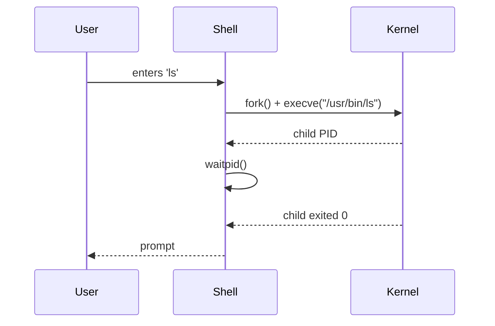
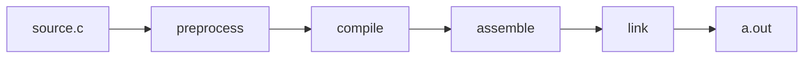
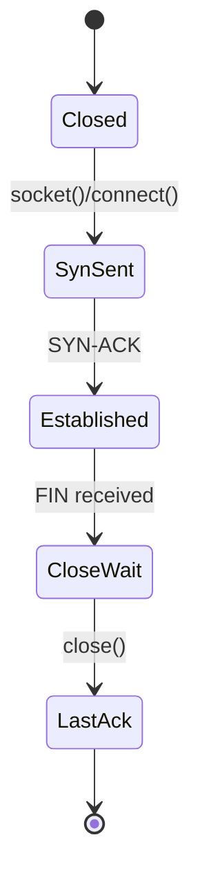
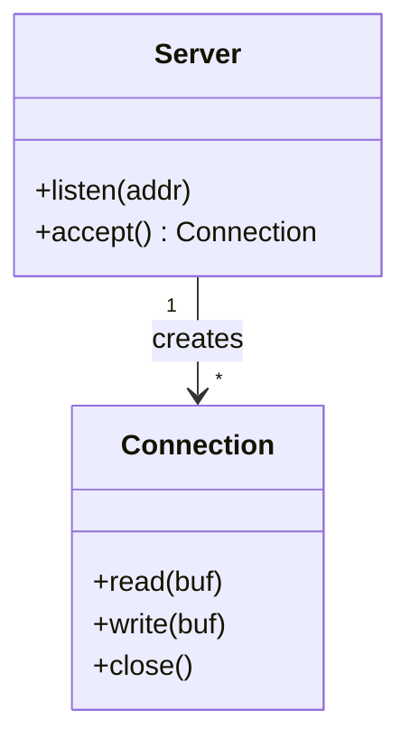

# Markdown feature gallery

A live demo of GitHub-flavored Markdown features. Open this file in:

- GitHub's web view (renders everything)
- VS Code's Markdown preview (`Cmd/Ctrl-Shift-V`)
- Obsidian / Logseq (most extensions supported)

## 1. Headings, paragraphs, emphasis

This is a paragraph with **bold**, *italic*, ~~strikethrough~~, and `inline code`.

## 2. Lists

Unordered:

- one
- two
  - nested
- three

Ordered:

1. one
2. two
3. three

Task list (GitHub renders interactive):

- [x] write the lesson
- [ ] add Mermaid examples
- [ ] add a PlantUML example

## 3. Tables

| Tool | Renders | Embeds in Markdown? |
|------|---------|---------------------|
| Mermaid  | flowcharts, sequence | yes (GitHub native) |
| PlantUML | UML deployments      | needs render step   |
| Graphviz | dot graphs           | needs render step   |

Aligning:

| left | center | right |
|:-----|:------:|------:|
| a    | b      | c     |

## 4. Code blocks

```c
int main(void) {
    return 0;
}
```

```rust
fn main() {
    println!("hello, {}", std::env::args().nth(1).unwrap_or("world".into()));
}
```

## 5. Callouts (GitHub-flavored)

> [!NOTE]
> Mermaid renders natively in GitHub Markdown.

> [!WARNING]
> Don't put screenshots of code in docs.

> [!TIP]
> Use `> [!IMPORTANT]`, `> [!CAUTION]`, `> [!NOTE]`, `> [!TIP]`, `> [!WARNING]`.

## 6. Collapsible sections

<details>
<summary>Click to expand: the full Mermaid sequence diagram example</summary>



</details>

## 7. Footnotes

This sentence has a footnote.[^1]

[^1]: This is the footnote. Renders at the bottom on GitHub; works in most renderers.

## 8. Mermaid examples

### Flowchart



### State diagram



### Class diagram



## 9. Anchors and internal links

Headings auto-anchor. Link with `[text](#headings-paragraphs-emphasis)`.

## 10. Images (commit + reference)

```markdown

```

Commit the image alongside the Markdown; reference via relative path so it works on GitHub and in static-site builds.
