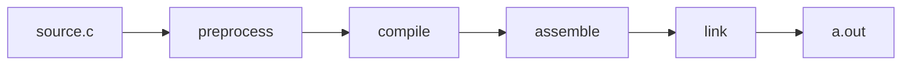
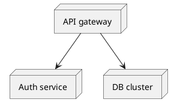
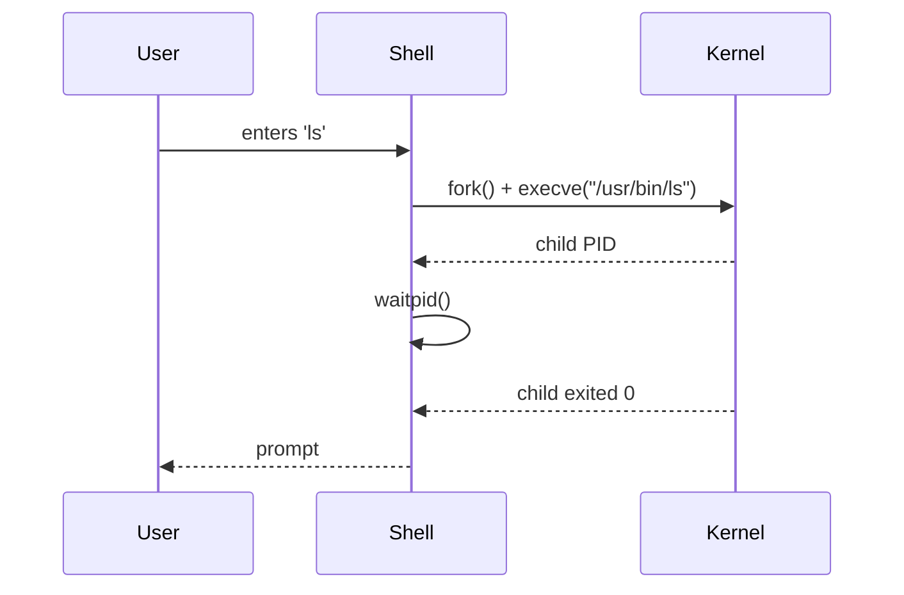

# Documentation & Diagrams — Markdown, Mermaid, plantuml

> The diagrams in your head fade. The ones in your repo don't. Write the second kind.

**Type:** Learn
**Languages:** Markdown
**Prerequisites:** Phase 00, Lesson 03
**Time:** ~45 minutes

## Learning Objectives

- Author Markdown that renders well on GitHub, in editors, and in static-site generators — including code blocks, tables, callouts, and footnotes.
- Embed Mermaid diagrams (flowchart, sequence, class, state, ER) in Markdown so they version-control as text but render as images.
- Use PlantUML for diagrams Mermaid can't do well (deployment, large architectures, BPMN).
- Apply the "documentation pyramid" — README → ADRs → reference docs → tutorials — and know what content belongs where.

## The Problem

A six-year-old codebase has more documentation surface than code. Some of it is good and load-bearing — the kind that, once removed, breaks teams. Most is the other kind: stale, vague, copy-pasted, contradicted by the code. Worse, many CS projects ship *no* docs and rely on tribal memory ("ask Aman").

Two questions decide whether your docs help or hurt:

1. Will they age well? If a diagram lives in a screenshot in Confluence, no one will update it when the code changes; six months later the diagram lies. If it's in a Mermaid block in a `README.md` next to the code, the diff that changes the code can change the diagram in the same commit.
2. Are they where readers look? The README is the first page; nobody reads a docs wiki on first contact. Put the things readers need first, in the file they're guaranteed to open.

This lesson is the working set: Markdown patterns that render everywhere, Mermaid syntax for the diagrams you'll draw most, and the rules of thumb for what to write where.

## The Concept

### The documentation pyramid

```
                ┌──────────────────┐
                │   README.md      │   first-touch: what is this, why, how to run
                ├──────────────────┤
                │   docs/          │   tutorials + reference; deeper but optional
                │   ├── adr/       │   architecture decisions, dated, never edited after merge
                │   ├── concepts/  │   "how it works" prose
                │   └── api/       │   generated reference (from rustdoc, pydoc, etc.)
                ├──────────────────┤
                │   code comments  │   tactical "why this is weird here"
                └──────────────────┘
                     wide bottom = lots; narrow top = a few essential pieces
```

Bad codebases invert this: a wiki nobody touches at the top, no README, no in-source comments. Good codebases over-invest in the bottom two layers because that's what people actually read.

### Markdown features worth using

GitHub-flavored Markdown supports more than people use. The high-leverage features:

- **Code fences with language** — syntax highlighting *and* a hint for the reader: `` ```rust ``
- **Tables** — pipes and dashes; aligners with `:--`, `--:`, `:--:`
- **Task lists** — `- [ ]` and `- [x]` (useful in issues and TODOs)
- **Collapsible sections** — `<details><summary>...</summary>...</details>`
- **Callouts (GitHub)** — `> [!NOTE]`, `> [!WARNING]`, `> [!TIP]`
- **Footnotes** — `text[^1]` ... `[^1]: explanation`
- **Anchors** — every heading auto-gets `#some-heading`; link with `[text](#some-heading)`

### Mermaid: text-as-diagram, version-controlled

Mermaid is a JS library that renders diagrams from a text DSL. GitHub renders it natively in Markdown:

````markdown

````

That block renders as a diagram in any GitHub README, in VS Code's Markdown preview, in mkdocs-material, in Obsidian, etc. The source text is in the file — when the diagram is wrong, you `Edit` and commit the fix; no exporting from a separate app.

Mermaid diagram types worth knowing:

| Diagram | Use case | First line |
|---------|----------|------------|
| flowchart | Boxes-and-arrows, decision trees | `flowchart TB` (top-bottom), `LR`, etc. |
| sequence  | Time-ordered interactions between actors | `sequenceDiagram` |
| classDiagram | OOP class structure | `classDiagram` |
| stateDiagram-v2 | State machines | `stateDiagram-v2` |
| erDiagram | Entity-relationship for DB schemas | `erDiagram` |
| gantt | Project timelines | `gantt` |
| journey | User journeys | `journey` |

### PlantUML: when Mermaid runs out

Mermaid is fast and ubiquitous. It's also limited: layout control is rough, certain UML constructs (component, deployment, large class diagrams) are awkward, and very large diagrams render slowly.

PlantUML covers those cases. The source text is in a `.puml` file (or fenced `plantuml` block); render with `plantuml` CLI to SVG/PNG:



The trade-off: PlantUML needs a Java runtime and isn't rendered natively on GitHub (you commit the rendered image alongside the source, or use a CI step to render).

### Anti-patterns

| Anti-pattern | What goes wrong |
|--------------|-----------------|
| Screenshots of diagrams | They age out of date silently; nobody edits them; they don't survive refactors |
| Inline ASCII art for complex layouts | Doesn't scale past 8–10 nodes; awkward to edit |
| "TBD" / "draft pending" sitting for months | Worse than no docs — readers assume the section exists and trust it |
| Long preambles before "how to run" | Put quick-start in the first 30 lines of README; readers stop scrolling |
| Auto-generated API docs as the only documentation | They're a reference, not a tutorial — readers need both |
| Diagrams that show *files*, not *concepts* | The file structure changes; the concept usually doesn't |

### ADRs — Architecture Decision Records

When a non-obvious design decision is made, capture it as a short Markdown file:

```markdown
# ADR-0007: Use Postgres MVCC over SQLite for the catalog service

Date: 2026-05-12
Status: Accepted
Deciders: Ana, Priya, Tomás

## Context

Catalog service handles ~3k qps with frequent updates. SQLite's writer lock
serializes us; we hit ~200 qps in load tests.

## Decision

Migrate the catalog to Postgres with default MVCC.

## Consequences

+ Concurrent writers; matches the load profile.
- Adds ops surface (backups, failover); see ADR-0008.
- Drops zero-config deployment for dev — devs now need Docker.

## Alternatives considered

- Sharded SQLite (rejected: cross-shard queries are painful)
- DynamoDB (rejected: cost; eventual consistency would break our existing reads)
```

ADRs are dated, numbered, never edited after acceptance. Newer ADRs supersede older ones explicitly. The repo's `docs/adr/` index is a chronological list — read the chain to understand why the system looks like it does.

## Build It

### Step 1: Markdown patterns

The lesson's `code/notes.md` contains examples of every Markdown feature listed above: tables, callouts, footnotes, task lists, collapsibles. Open it in GitHub's preview (or VS Code's Markdown preview) and compare the source to the rendering.

### Step 2: Mermaid in this lesson's file

Look at this lesson's `docs/en.md` — note that this lesson itself uses Mermaid in a couple of places (try adding one), and the course's `README.md` uses a Mermaid `flowchart TB` to render the phase graph.

Try authoring one:

````markdown

````

Save it in a `.md` file, push to GitHub, and it renders inline.

### Step 3: PlantUML rendering

Install:

```sh
# macOS
brew install plantuml graphviz

# Debian/Ubuntu
sudo apt install plantuml graphviz
```

Render:

```sh
plantuml outputs/arch.puml -o .          # produces arch.png next to the .puml
```

### Step 4: Write a real ADR

For the course itself, write an ADR explaining "why we chose Rust + C for systems lessons rather than C++ everywhere." Use the template above; save as `docs/adr/0001-language-choice.md`.

### Step 5: Lint your Markdown

Markdown's permissiveness lets bad docs survive. Lint them:

```sh
npm install -g markdownlint-cli
markdownlint README.md docs/**/*.md
```

Add to CI; rejected PRs that have broken links or inconsistent style are a feature, not a bug.

## Use It

- **Rust's docs.rs** is generated from rustdoc + Markdown. Every published crate has a beautiful, navigable docs site for free.
- **mkdocs-material** + **Mermaid** is the most common static-site stack for project documentation (FastAPI, Pydantic, dozens more use it).
- **GitHub Wiki** is fine for casual docs but doesn't versioned diff with the code — prefer `docs/` in the repo whenever a doc and a piece of code share a lifecycle.
- **C4 model diagrams** (system → container → component → code) are a standard layered approach for architecture docs; works in both Mermaid and PlantUML.

## Read the Source

- [GitHub Flavored Markdown spec](https://github.github.com/gfm/) — the dialect 99% of you target.
- [Mermaid documentation](https://mermaid.js.org/intro/) — the full DSL; flowcharts and sequence diagrams cover most needs.
- [ADR examples in the wild](https://github.com/joelparkerhenderson/architecture-decision-record) — index of public ADR-using projects.
- [Diátaxis](https://diataxis.fr/) — a framework for separating tutorials, how-to guides, reference, and explanation. Surprisingly transformative.

## Ship It

This lesson ships **`outputs/adr-template.md`** (the template you'll use for every ADR in the course) and **`outputs/mermaid-cheatsheet.md`** (the most common Mermaid diagram skeletons, copyable).

## Exercises

1. **Easy.** Add a Mermaid sequence diagram to *any* README in the course showing a runtime interaction (e.g., L02's user → shell → kernel sequence). Commit, push, and verify GitHub renders it.
2. **Medium.** Write an ADR for a real decision in your own project (or invent one — "use Postgres over SQLite," "split foo service into two"). Use the lesson's template. Aim for ~300 words.
3. **Hard.** Convert a slide-deck architecture diagram (PowerPoint or Figma) into a PlantUML deployment diagram. Render it. Commit both the `.puml` source and the rendered PNG. Future edits will go through the text source — that's the win.

## Key Terms

| Term | What people say | What it actually means |
|------|----------------|------------------------|
| Markdown | "Text formatting" | A lightweight markup language with a small core spec + many extensions (GFM, MyST, CommonMark) |
| Mermaid | "Diagram tool" | A JS library that renders diagrams from a text DSL; first-class support in many platforms |
| PlantUML | "Heavier diagram tool" | A Java-based diagram renderer with a richer DSL for UML-style diagrams |
| ADR | "Decision doc" | A short, dated, append-only Markdown file capturing one non-obvious design decision |
| C4 model | "Architecture levels" | A four-level zoom (system → container → component → code) for describing software architecture |

## Further Reading

- *Documenting Software Architectures: Views and Beyond* (Clements et al.) — classic, dense, comprehensive.
- [Write the Docs community](https://www.writethedocs.org/) — talks and articles from people who do this professionally.
- [Julia Evans's blog](https://jvns.ca/) — model for how to explain technical concepts crisply with diagrams.
