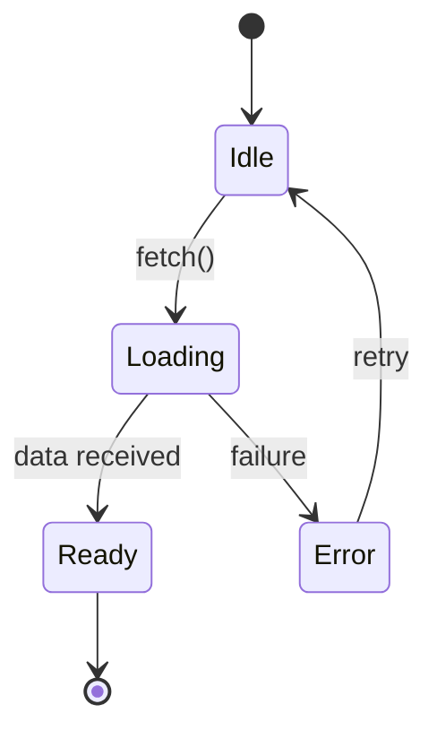
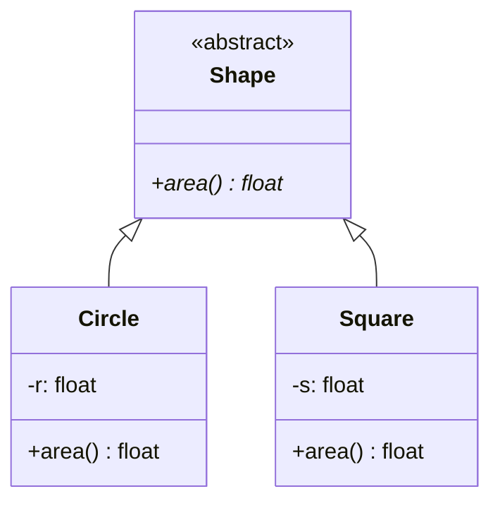
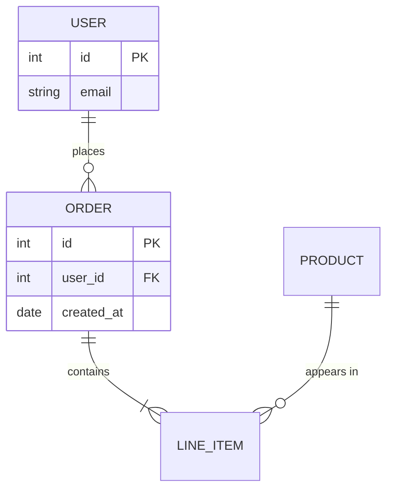
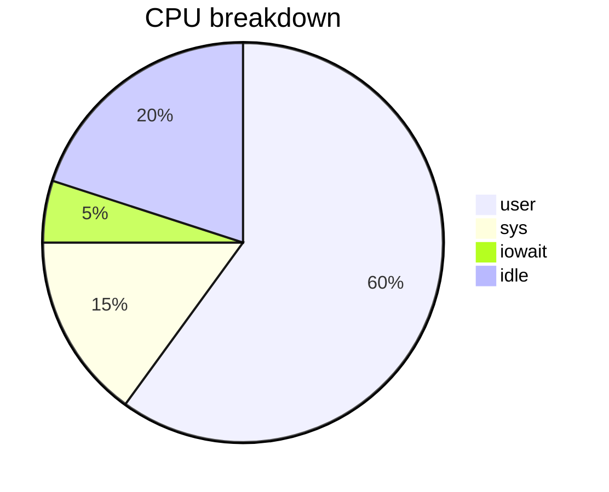
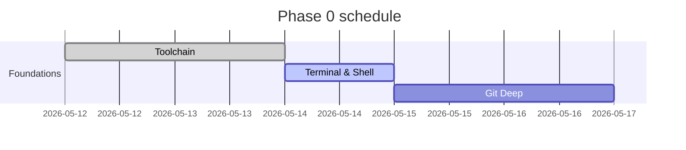

# Mermaid Cheat Sheet — Copy-Paste Skeletons

GitHub, GitLab, VS Code Markdown preview, mkdocs-material, Obsidian — all render these natively.

## Flowchart

```mermaid
flowchart TB
  A[Start] --> B{Decision?}
  B -->|yes| C[Action 1]
  B -->|no|  D[Action 2]
  C --> E[End]
  D --> E
```

Direction: `TB` (top→bottom), `BT`, `LR` (left→right), `RL`.

## Sequence

```mermaid
sequenceDiagram
  autonumber
  actor Client
  participant API as API server
  participant DB

  Client->>API: POST /order
  API->>DB: BEGIN; INSERT
  DB-->>API: ok
  API-->>Client: 201 Created
  Note over API,DB: async commit hook fires
```

## State



## Class



## Entity-relationship



## Pie



## Gantt



## Tips

- IDs (`A`, `B`) are case-sensitive and reused across blocks.
- Quote labels with `["text"]` if they contain `:`, `(`, or spaces with weird chars.
- For long subtitles, use `\n` (literal `\n` in the source); Mermaid renders it as a newline.
- `subgraph name [...]` groups nodes.
